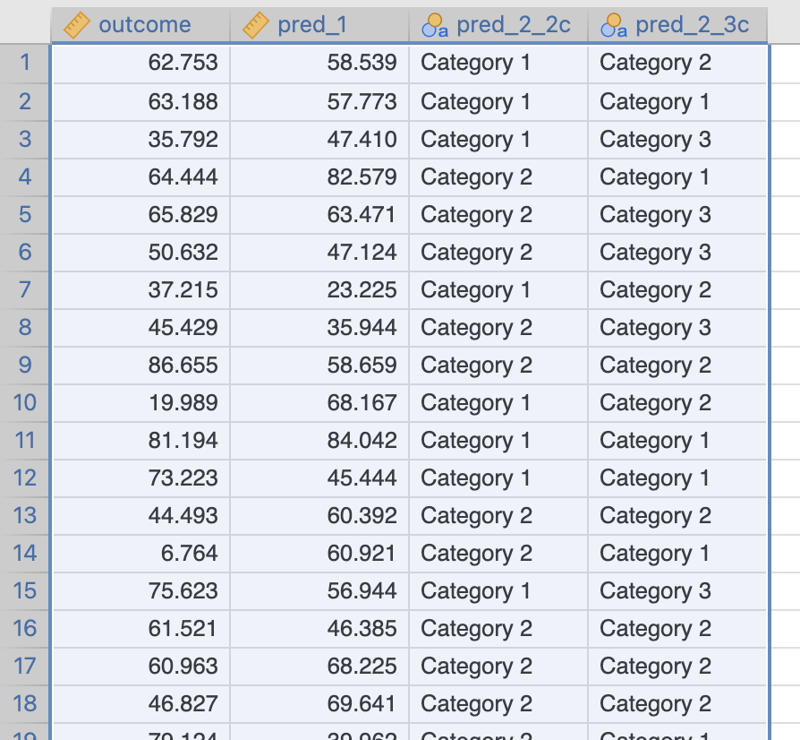
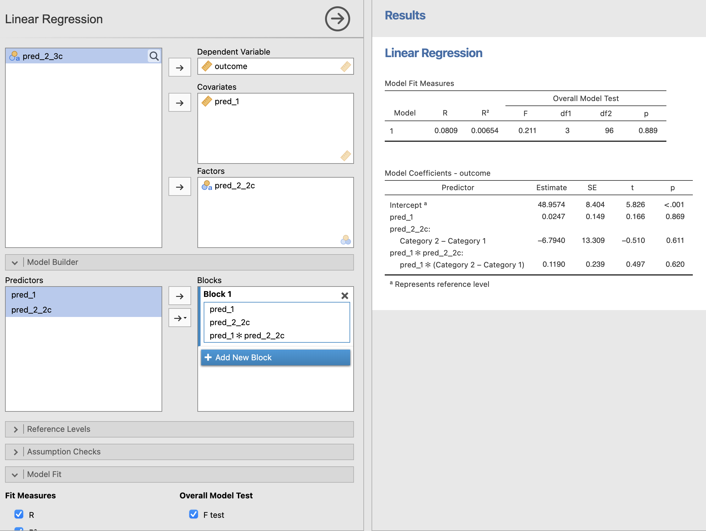
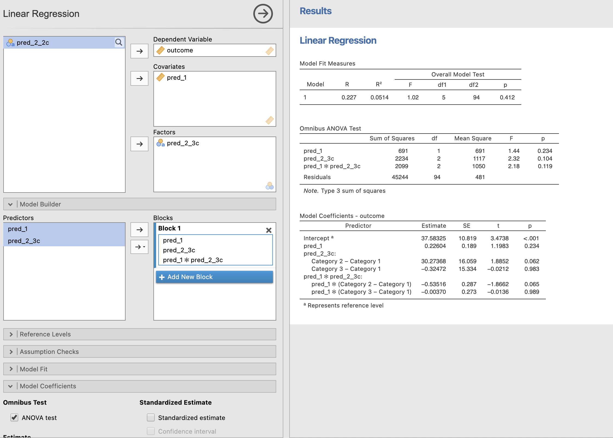

```{r setup, include = FALSE}
# general options --------------------------------------------------------------
options(scipen = 999)
set.seed(123)
# chunk options ----------------------------------------------------------------
knitr::opts_chunk$set(
  cache.extra = knitr::rand_seed, 
  message = FALSE, 
  warning = FALSE, 
  error = FALSE, 
  echo = FALSE,
  cache = FALSE,
  comment = "", 
  fig.align = "center", 
  fig.retina = 3
  )
# libraries --------------------------------------------------------------------
library(emo)
library(knitr)
library(tidyverse)
library(nomnoml)
library(DiagrammeR)
library(fontawesome)
```

In academic research paper all sections are linked:

**Introduction `r ji("right_arrow")` Literature Review `r ji("right_arrow")` Method `r ji("right_arrow")` Results `r ji("right_arrow")` Discussion & Conclusion**

To understand the statistics in the results section it is essential to identify the concepts presented in each section:

```{nomnoml, fig.width=6, fig.height=1}
#stroke: black
#direction: right
#align: center
[Introduction | Variables]->[Literature Review | Hypotheses]
[Literature Review | Hypotheses]->[Method | Model & Equation]
[Method | Model & Equation]->[Results | Statistical Test]
[Results | Statistical Test]->[Discussion & Conclusion | Interpretation]
```

# Variables

A variable ...

- Is way of assigning values (numbers or characters) to labels
- Corresponds to a column in a spreadsheet

> Challenge: Identify the **Role** and the **Type** of each variable

## Type of Variables

There are many type for variables but the only that we should care are ...
- **Continuous**: If values are numbers
- **Categorical**: If values are characters

> Note: Distinguish **Categorical Nominal** variables (*e.g.*, Irish, French) vs. **Categorical Ordinal** variables (*e.g.*, XS, S, M, L, XL)

```{r out.width='20%', fig.cap='Icons used in Jamovi to indicate the variable types'}
knitr::include_graphics("img/jamovi_icons.png")
```

## Role of Variables

A variable can have one or the other of these roles (no other role exist):

- **Outcome**: "to be explained" variable as Y (also called Dependent Variable or DV)
- **Predictor**: "doing the explaining" as X (also called Independent Variable or IV)

> Note: A variable can be also both but in different hypotheses

# Hypotheses

## Correct Hypothesis Formulation

Hypotheses are:

- Predictions supported by theory/literature
- Affirmations designed to precisely describe the relationships between variables

A hypothesis test consists of a test between two competing hypotheses:

- An alternative hypothesis $H_a$ (also called $H_1$) formulated by the researcher
- A null hypothesis $H_0$ (pronounced "H-naught") counter to every alternative hypothesis

> Note: For $H_0$, there is no relationship between the variables. $H_a$ is the "challenger" hypothesis, it claims the existence of a relationship.

Only 2 kind of alternative hypotheses can be formulated:

- **Main Effect Hypothesis**: Relationship between 1 Predictor and 1 Outcome
- **Interaction Effect Hypothesis**: Relationship between 2+ Predictors and 1 Outcome

> Challenge: **Appropriate Formulation** the hypothesis according to the type of the Predictor

## Main Effect Hypothesis Formulation

The **Outcome has to be Continuous** but ...

- Case 1: Predictor is Continuous 

The {**outcome**} increases when {**predictor**} {*increases/decreases/changes*}

- Case 2: Predictor is Categorical (2 Categories)

The {**outcome**} of {**predictor category 1**} is {*higher/lower/different*} than the {**outcome**} of {**predictor category 2**}

- Case 3: Predictor is Categorical (3 or more Categories)

The {**outcome**} of at least one {**predictor**} category is {*higher/lower/different*} than the other {**predictor**} categories

## Interaction Effect Hypothesis Formulation

The **Outcome has to be Continuous** and **whatever the Predictor 1 is** ...

- Case 1: Predictor 2 is Continuous

The effect of {**predictor 1**} on {**outcome**} is {*higher/lower/different*} when {**predictor 2**} increases

- Case 2: Predictor 2 is Categorical (2 Categories)

The effect of {**predictor 1**} on {**outcome**} is {*higher/lower/different*} for {**predictor 2 category 1**} than for {**category 2**}

- Case 3: Predictor 2 is Categorical (3 or more Categories)

The effect of {**predictor 1**} on {**outcome**} is {*higher/lower/different*} for at least one of {**predictor 2**}

> Notes:
> 
1. Predictor 1 and 2 are commutable (can be inverted and produce the same hypothesis)
2. An interaction effect hypothesis is also called moderation effect
3. By default, an interaction effect involves the test of the main effect hypotheses of all Predictors involved

# Model & Equation

The basic structure of a statistical model is:

$$Outcome = Model + Error$$

where the $Model$ is a series of predictors that are expressed in hypotheses related to the same outcome.
- Main effect hypotheses are indicated with the predictor name only
- Interaction effect hypotheses are indicated with all predictor names separated by $*$

Example:

$$Outcome = Pred1 + Pred2 + Pred1 * Pred2 + Error$$

To evaluate their relationship with the outcome, each effect hypothesis is related with a coefficient called **Estimate** and represented with $\beta$ as follow:

$$Outcome = \beta_0 + \beta_1 Pred1 + \beta_2 Pred2 + \beta_3 Pred1 * Pred2 + Error$$

> Note: $\beta_0$ is the estimate related to the intercept. It is always included, always tested but has no interest in the analysis

## Evaluation of the Significance

Testing for the significance of the effect means evaluating if this estimate $\beta$ value is significantly **different, higher or lower than 0** as hypothesised in $H_a$:

- $\beta \neq 0$ means our hypothesis doesn't precise the direction of the change, just that there is a change
- $\beta > 0$ means our hypothesis indicates that the relationship increases or a group is higher than another group
- $\beta < 0$ means our hypothesis indicates that the relationship decreases or a group is lower than another group

> Note: $H_0$ will always predict that $\beta = 0$

The significance, called $p$-value, is the probability to consider $H_0$ as True. This probability is between 0% and 100% which corresponds to a value between 0.0 and 1.0.

If the $p$-value:

- Is **higher** than 5% or 0.05, then $H_0$ is **accepted**
- Is **lower** than 5% or 0.05, then $H_0$ is **rejected** and $H_a$ is considered as plausible

## Graphic Representation of a Model

A graphic representation of the model's hypothesised effects can be done:
- All the arrows correspond to an hypothesis to be tested
- All the tested hypotheses have to be represented with an arrow

**A simple arrow is a main effect**

```{r eval=TRUE}
DiagrammeR::grViz("
digraph rmarkdown {
  graph [rankdir = LR]
  
  node [shape = oval]
  Predictor; Outcome
        
  Predictor -> Outcome [label= β1]
}
", width = 400, height = 200)
```

**A crossing arrow is an interaction effect**

```{r}
DiagrammeR::grViz("
  digraph {
    graph [rankdir = LR]
  
    node [shape = circle]
    'Predictor 1'; Outcome; 'Predictor 2'
    node [shape = point, width = 0, height = 0]
    ''
    
    'Predictor 2' -> '' [label= β2]
    'Predictor 1' -> '' [arrowhead = none] [label= β1]
    ''-> Outcome [label= β3]
    
    subgraph {
      rank = same; 'Predictor 2'; '';
    }
  }", height = 200, width = 400)
```

> Note: By default, an interaction effect involves the test of the main effect hypotheses of all Predictors involved

# Statistical Test

## JAMOVI: Stats. Open. Now.

Jamovi an be downloaded or used online on https://www.jamovi.org/

A free book "Learning Statistics with Jamovi" by Navarro and Foxcroft (2019) is available online here: https://www.learnstatswithjamovi.com/

Advantages:

1. Free
2. Simple Interface
3. No Missing Values to Declare
4. No Variable to Recode by Default
5. Ready to Publish Tables and Figures
6. Free Modules for Advanced Statistics (Mediation, Generalized LM, Linear Mixed Model)

> Note: In Jamovi ...
>
- The outcome is called Dependent Variable
- A continuous predictor is a covariate
- A categorical predictor is a factor

```{r out.width='40%', fig.cap='Example of data visualisation in Jamovi with continuous and categorical variables'}

```

## Hypotheses with Continuous Predictors and with Categorical Predictors Having 2 Categories

Steps:

1. Open your file
2. Check the type of your variables
3. **Analyses** > **Regression** > **Linear Regression**
4. Set the Outcome as DV and 
  - **To test the main effect hypotheses**: set the Predictors as Covariates/Factors
  - **To test interaction effect hypotheses**: In Model Builder, select all predictor with `CTRL` (win) or `Command` (mac) and bring them as interaction in the model
  
Communicate the Results about the full model and each hypothesis:

- Use **Model Fit Measure Table** to evaluate the accuracy of the full model

The predictions from a model including all effects are significant/not-significant better than without these effects ( $R^2 = value_{R^2}$, $F(df1,df2) = value_{F}$, $p = value_{p}$)

- Use **Model Coefficients Table** to conclude about each hypothesis

The effect of $Predictor$ on $Outcome$ is statistically significant/not-significant, therefore $H_0$ can be rejected/accepted ( $b = value_{estimate}, 95\% CI [lower\,CI, upper\,CI]$, $t(df) = value_t$, $p = value_{p}$).

```{r out.width='70%', fig.cap='Test of a model including 2 main effect hypotheses and 1 interaction effect hypothesis with a continuous  predictor and a categorical predictor having 2 categories'}

```

## Hypotheses with Categorical Predictors Having 3 or more Categories

1. Open your file
2. Check the type of your variables
3. **Analyses** > **Regression** > **Linear Regression**
4. Set the Outcome as DV and 
  - **To test the main effect hypotheses**: set the Predictors as Factors
  - **To test interaction effect hypotheses**: In Model Builder options, select all predictor with `CTRL` (win) or `Command` (mac) and bring them as interaction in the model
5. Tick **ANOVA Test** in Model Coefficient options
  
Communicate the Results about the full model and each hypothesis:

- Use **Model Fit Measure Table** to evaluate the accuracy of the full model

The predictions from a model including all effects are significant/not-significant better than without these effects ( $R^2 = value_{R^2}$, $F(df1,df2) = value_{F}$, $p = value_{p}$)

- Use **Omnibus ANOVA Test Table** to conclude about each hypothesis

The effect of $Predictor$ on $Outcome$ is statistically significant/not-significant, therefore $H_0$ can be rejected/accepted ( $F(df_{predictor}, df_{residual}) = value_F$, $p = value_{p}$).

```{r out.width='70%', fig.cap='Test of a model including 2 main effect hypotheses and 1 interaction effect hypothesis with a continuous  predictor and a categorical predictor having 3 categories'}

```

# Discussion & Conclusion

From here...

- There is no number to be shown and no specific guidelines
- Correct interpretation comes if results have been understood and if reasons for the results to be the ones obtained have been identified

```{r out.width='40%', fig.cap='Source @iopsychmemes'}
include_graphics("https://pbs.twimg.com/media/EhjV0v-XgAEh2pk?format=jpg&name=large")
```

# Contact

This guide is the shortest guide I was able to write to give an outline of hypothesis testing for academic research using Jamovi.

A lot more can be said, but I strongly recommand to have a look at ["Learning Stats with Jamovi"](https://www.learnstatswithjamovi.com/) by Navarro and Foxcroft (2019) if you want to know more


[`r fa(name = "link")` damien-datasci-blog.netlify.app](https://damien-datasci-blog.netlify.app)

[`r fa(name = "paper-plane")` damien.dupre@dcu.ie](mailto:damien.dupre@dcu.ie)