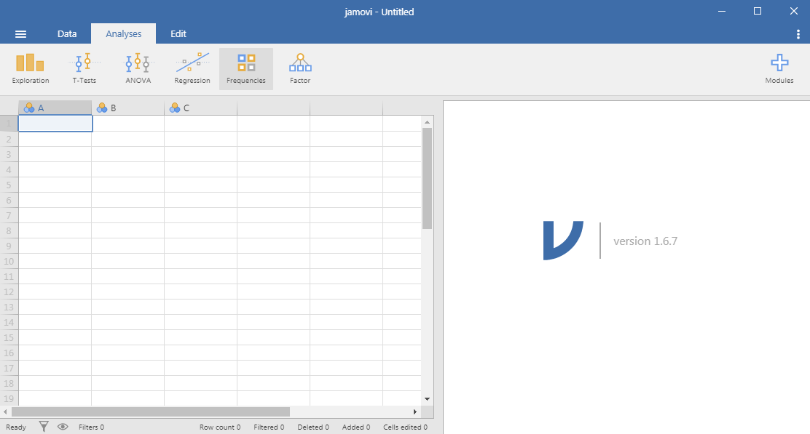
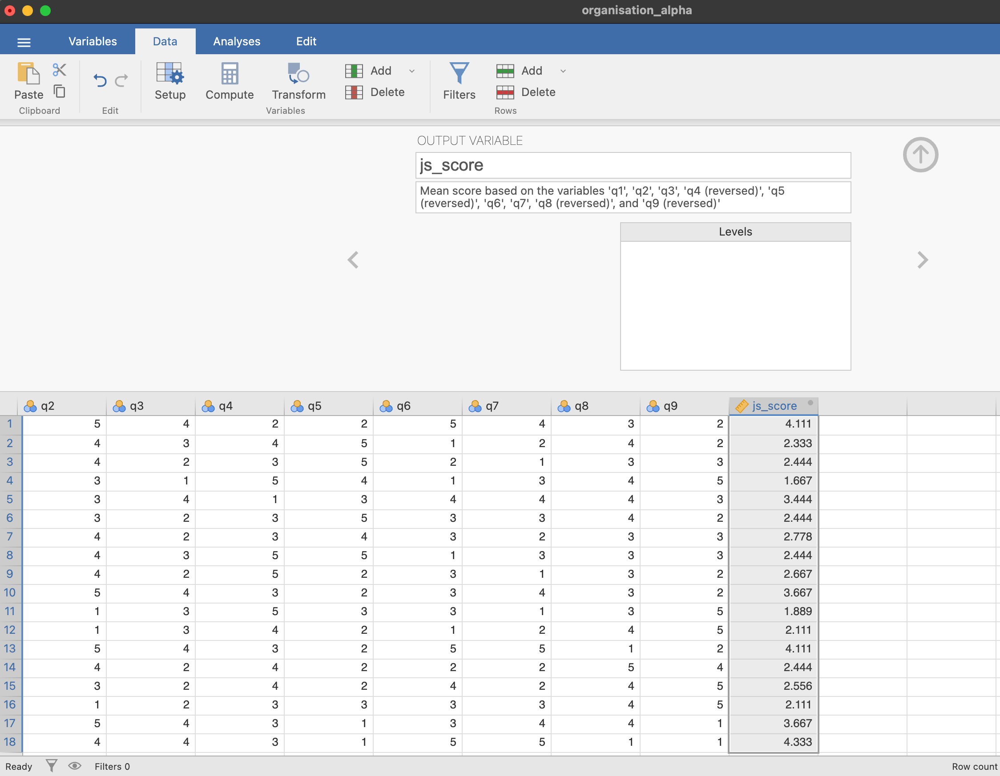
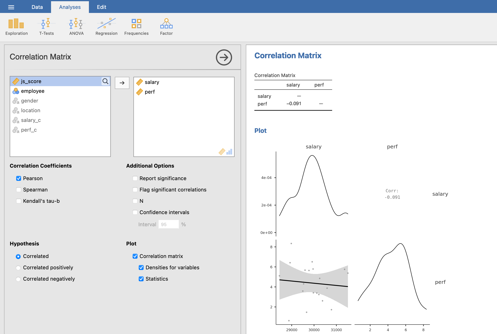

```{r setup, include = FALSE}
# libraries --------------------------------------------------------------------
library(anicon)
library(countdown)
library(DiagrammeR)
library(fontawesome)
library(kableExtra)
library(knitr)
library(tidyverse)

# general options --------------------------------------------------------------
options(scipen = 999)
set.seed(123)

# chunk options ----------------------------------------------------------------
opts_chunk$set(
  cache.extra = rand_seed, 
  message = FALSE, 
  warning = FALSE, 
  error = FALSE, 
  echo = FALSE,
  cache = FALSE,
  comment = "", 
  fig.align = "center", 
  fig.retina = 3
  )
```

# Objectives

#### This workshop has been organised to help you dealing with the Statistics part of your assignment, and this is exactly what we will do!

*Here are your instructions:*

--

- You need the original numerical raw data- not data where the analysis has already been done e.g by consultants.

> **What is a clean dataset and how to do the transformations required before statistical analyses?**

--

- You should report results on statistical analysis in layman terms to demonstrate understanding.

> **Why are we doing statistical analyses in simple terms?**

---

# Objectives

- The level of statistical analyses required includes descriptive statistics e.g. reporting means/averages but go beyond this to show impact on X?.
  
> **How to do descriptive statistics and inferential statistics in JAMOVI?**

--

- Produce (only as is relevant to your question) t-tests, correlations, regressions, ANOVA (not all of these will be relevant to everyone’s question so choose the appropriate statistical test for the question posed).

> **How to choose a statistical test?**

--

- You can include control data (if you wish but not necessary) (other variables which may effect the variables you are studying- but just the minimum) in your analysis e.g. gender, age, education etc.
  
> **What are the different roles of variables and how to process them?**

--

- If your results reveal no relationship- that is fine- critique your approach, context and discuss your ‘no relationship’ finding in context of scientific evidence

> **How to interpret the results of a statistical analysis?**

---

# JAMOVI: Stats. Open. Now.

Jamovi is a statistical spreadsheet software designed to be **easy to use**. Jamovi is a compelling alternative to costly statistical products such as SPSS, SAS and JMP to cite a few.

Jamovi will always be **free and open** because Jamovi is made by the scientific community, for the scientific community.

- It can be **downloaded from its website** https://www.jamovi.org/
- It can also be **used without installation**, in a web browser, https://cloud.jamovi.org/ for **online demo** but this demo undergoes periods of downtime, and may cease functioning (without warning) at any time.

`r faa("exclamation-triangle", animate="flash", speed="slow", color="red")` Book "Learning Statistics with JAMOVI" free here: https://www.learnstatswithjamovi.com/

```{r out.width = "100%"}
include_graphics("https://www.jamovi.org/assets/header-logo.svg")
```

---

# JAMOVI GUI

```{r out.width = "100%"}

```

---
class: title-slide, middle

## Demonstration

---

class: inverse, mline, center, middle

# 1. What is a clean dataset and what are the transformations required before statistical analyses?

---

# What is a clean dataset?

.pull-left[
### 1. Ditch the chart and all non values
Charts can mess up with other software

### 2. Headings in row 1
Remove blank rows and no more than 1 heading row

### 3. Columns start at column A
Remove blank columns

### 4. Do not replace missing values
Leave missing values empty
]

--

.pull-right[
```{r out.width = "100%"}


```
]

---

# What are the transformations required?

If your data is not from a survey, **no transformation required**

--

If your data is from a survey: 

### 1. Convert opinion scales from text to numeric
- e.g., "Strongly Disagree" becomes 1, "Strongly Agree" becomes 7, ...
- Sometimes it is automatically done by the survey platform, **if not you have to manually convert** participants' answers to numbers.
- In EXCEL, `Replace All` can be efficient but also dangerous (e.g., replacing "Agree" with "4" will change all "Strongly Agree" to "Strongly 4")

### 2. Calculate an average score for the psychometric scales
- Multiple questions are used to assess the same latent variable (e.g., job satisfaction of employees)
- All questions need to have the same range of answer possibilities (e.g., from strongly disagree to strongly agree)

---

# What are the transformations required?

Some scales include **negative formulation** of some questions to check that participants are reading the questions.

For example, in a Job Satisfaction scale:
- $q1$: I love my job
- $q2$: I like going to work everyday
- $q3$: I hate what I'm doing at work

If I have a high Job Satisfaction, I will agree with the 2 first questions and disagree with the 3rd question. 

However, to calculate a Latent Variable score **all items should have the same formulation** (all positive formulation or all negative formulation). 

Here, **the answers of the 3rd item have to be reversed**.

---

# What are the transformations required?

In our example, here are the results with 3 employees:
- The item $q3$, negatively formulated, has been reversed in $q3_r$
- The score of the "Job Satisfaction" latent variable is calculated using the average of $q1$, $q2$ and $q3_r$ items.

```{r}
tribble(
  ~employee, ~q1, ~q2, ~q3, ~q3_r,
   "Sinead",   7,   5,   2,     8,
  "Patrick",   5,   4,   6,     4,
   "Damien",   3,  1,    7,     3
) |> 
  rowwise() |> 
  mutate(job_satisfaction_score = mean(c(q1, q2, q3_r))) |> 
  kable(
    # col.names = c("employee", "$q1$", "$q2$", "$q3$", "$q3_r$", "job_satisfaction_score"),
    # escape = TRUE
  )
```

---

# What are the transformations required?

In order to create an average score for each latent variable of your survey, **you need to make sure that your scale is reliable**.

Reliability assessment is performed every time a scale is used by **calculating its Cronbach's alpha**.

Cronbach's alpha indicates the **overall correlation between questions** (inter-item correlation).

Cronbach's alpha has a maximum of 1:

- If its value is **higher than 0.7**, then the scale is reliable to measure the latent variable 
- If its value is **lower than 0.7**, then proceed with caution or remove/modify the scale to obtain a value higher than 0.7

**Latent variables are calculated only if the scale reliability (Cronbach's alpha) is satisfactory.**

---

# Automatic Calculation

In JAMOVI, you can automatically calculate a latent variable from within `Reliability Analysis` 

To automatically calculate the average of all items (including reversed items) and creating the latent variable score:

- After obtaining a satisfying Cronbach's alpha, unfold the `Save` options on the left menu.
- Tick `Mean score` (a new column is created in your data)

```{r out.width='60%'}

```

---

# Automatic Calculation

Rename the newly created column from the `Data` tab:

```{r out.width='60%'}

```

`r faa("exclamation-triangle", animate="flash", speed="slow", color="red")` Warning: the calculation of the average includes the reversed items but the values of the reversed items themselves haven't been modified in the Data.

---
class: title-slide, middle

## Demonstration

---
class: title-slide, middle

## Exercise

1. Open the file "organisation_alpha.xls" in Jamovi
2. Perform a reliability test of the items q1 to q9
3. Calculate the latent variable `Job Satistfaction` for these items

```{r}
countdown(minutes = 10, warn_when = 60)
```

---

class: inverse, mline, center, middle

# 2. Why are we doing statistical analyses in simple terms?

---
# Why are we doing statistical analyses?

The activity of research is about **analysing phenomena** using a rigorous methodology. 

--

Because causality analyses are extremely difficult, **research only look for relationships** between variables.

--

However, the **relationships observed in a sample are not necessarily generalisable** but due to a range of factors such as sample characteristics, study design, and potential confounding variables.

--

Therefore, hypotheses of the existence of relationships are tested by calculating **the probability to obtain the results knowing that there are no relationship beyond the sample**.

---

# What is a Variable?

A variable itself is a subtle concept, but basically it comes down to finding some way of assigning *numbers or characters* to **labels**.

For example:

- My **height** is *183 cm*
- This morning, I had a *large* **coffee**
- My **gender** is *male*

The **bold part is "the thing that varies"** and the *italicised part is "the value of the variable"*.

---
class: title-slide, middle

## Type of Variables

---

# Type of Variables

Variables can have different types:

- **Categorical**: If the variable's possibilities are words or sentences (character string)

  - if the possibilities cannot be ordered: Categorical Nominal (*e.g.*, $gender$ male, female, other)
  
  - if the possibilities can be ordered: Categorical Ordinal (*e.g.*, $size$ S, M, L)
  
- **Continuous**: If the variable's possibilities are numbers (*e.g.*, $age$, $temperature$, ...) 

`r faa("exclamation-triangle", animate="flash", speed="slow", color="red")` **Warning**: Variables can be converted to either Categorical and Continuous but it is always better to keep them in their correct scale.

```{r out.width='30%'}
knitr::include_graphics("img/jamovi_icons.png")
```

---
class: title-slide, middle

## Role of Variables

---

# Role of Variables

It's important to keep the two roles "variable doing the explaining" and "variable being explained" distinct.

Let's denote the:
 - **Outcome**: "variable to be explained" (also called $Y$, Dependent Variable, or DV)
 - **Predictor**: "variable doing the explaining" (also called $X$, Independent Variable, or IV)
 
--

Statistics is only about identifying relationship between Predictor and Outcome variables also called **effect**

> An effect between 2 variables means that the changes in the values of a predictor variable are related to changes in the values of an outcome variable.

--

The only difference for **control variables** is that they are included in the analysis but there are not included in the hypotheses.

They are used to remove an irrelevant explanation of the variable changes.

---

# Hypotheses in a Nutshell

Hypotheses are:
1. Predictions supported by theory/literature
2. Affirmations designed to precisely describe the relationships between variables

Their formulation include:

- Predictor(s) / Independent Variable(s)
- Outcome / Dependent Variable (DV)
- Direction of the outcome if the predictor increases

`r faa("exclamation-triangle", animate="flash", speed="slow", color="red")` **Warning**: 

Hypothesis cannot test equality between groups or modalities, they can only test differences or effects

---

# Alternative *vs.* Null Hypotheses

Hypotheses have to test differences or effects, they are also called $H_a$ (for alternative hypothesis)

Every alternative hypothesis has a null hypothesis counterpart (no difference between groups or according values) also called $H_0$ (pronounce H naught or H zero)

--

$H_a$ is viewed as a “challenger” hypothesis to the null hypothesis $H_0$.
  
> **Statistics are used to test the probability of obtaining your results if the Null Hypothesis is true. If this probability is low, then we reject the Null Hypothesis (and consider the Alternative Hypothesis as credible).**

--

But there is only two kind of alternative hypotheses: **Main Effect Hypotheses** and **Interaction Effect Hypotheses**

---

# Main Effect Hypothesis

Is the **predicted relationship between one $Predictor$ and one $Outcome$ variable**

- The $Outcome$ needs to be Continuous (but some complex models can use a Categorical Outcome)

- The $Predictor$ can be either Continuous or Categorical but the hypothesis formulation will change with its type

Effect representation:

```{r eval=TRUE, fig.align="left"}
DiagrammeR::grViz("
  digraph {
    graph [rankdir = LR]
    node [shape = box]
    
    'Predictor' -> 'Outcome'
  }", height = 200)
```

`r faa("exclamation-triangle", animate="flash", speed="slow", color="red")` **Warning**: The direction of the arrow does not involve causality, only correlation.

---

# Main Effect Hypothesis Templates

In the following formulation templates, **replace the variable names with yours** and *select the direction of the effect expected* ...

- #### Case 1: Predictor is Continuous 

.small[{**outcome**} {*increases/decreases/changes*} when {**predictor**} increases]

> .small[**Job satisfaction** *increases* when **salary** increases]

--

- #### Case 2: Predictor is Categorical (2 Categories)

.small[The {**outcome**} of {**predictor category 1**} is {*higher/lower/different*} than the {**outcome**} of {**predictor category 2**}]

> .small[The **Job satisfaction** of **EU employees** is *higher* than the **job satisfaction** of **Non-EU employees**]

--

- #### Case 3: Predictor is Categorical (3 or more Categories)

.small[The {**outcome**} of at least one of the {**predictor**} is {*higher/lower/different*} than the {**outcome**} of the other {**predictor**}]

> .small[The **Job satisfaction** of at least one of the **company's departments** is *higher* than the **Job satisfaction** of the other **company's departments**]

---

# Main Effect Hypothesis Examples

Variables:

- Outcome = Exam Results (continuous from 0 to 100)
- Predictor 1 = Sleep Time (continuous from 0h to 24h)
- Predictor 2 = Breakfast (categorical *yes* or *no*)

Effects representation:

```{r eval=TRUE, fig.align="left"}
DiagrammeR::grViz("
  digraph {
    graph [rankdir = LR]
    node [shape = box]
  
    'Sleep Time' -> 'Exam Results'
    'Breakfast' -> 'Exam Results'
  }", height = 200)
```

--

Main Effect Hypotheses: 

- $H_{a1}$: **Exam results** *increase* when students’ **sleep time** increases
- $H_{a2}$: **Exam results** of students **who eat breakfast** will be *higher* than **exam results** of students **who do not eat breakfast** 

---

# Interaction Effect Hypothesis

**It predicts the influence of a second predictor on the relationship between a first predictor and an outcome variable**

`r faa("exclamation-triangle", animate="flash", speed="slow", color="red")` **Warning**:

- The second predictor is also called moderator.
- The main effect of each predictor must be hypothesised as well
- The role of first and second predictors can be inverted with the exact same statistical results

.pull-left[
Effects representation:

```{r}
DiagrammeR::grViz("
  digraph {
    graph [rankdir = LR]
  
    node [shape = box]
    'Predictor 1'; 'Predictor 2'; Outcome
    node [shape = point, width = 0, height = 0]
    ''
    
    'Predictor 2' -> ''
    'Predictor 1' -> '' [arrowhead = none]
    ''-> Outcome
    
    subgraph {
      rank = same; 'Predictor 2'; '';
    }
  }", height = 200, width = 400)
```
]

.pull-right[

Exactly the same results:
```{r}
DiagrammeR::grViz("
  digraph {
    graph [rankdir = LR]
    node [shape = box]

    'Predictor 1' -> Outcome
    'Predictor 2' -> Outcome
    'Predictor 1 X Predictor 2' -> Outcome
  }", height = 200, width = 400)
```
]

---

# Interaction Effect Hypothesis Templates

In the following formulation templates, **replace the variable names with yours** and *select the direction of the effect expected* ...

--

- #### Case 1: Predictor 2 is Continuous

.small[The effect of {**predictor 1**} on {**outcome**} is {*higher/lower/different*} when {**predictor 2**} increases]

--

- #### Case 2: Predictor 2 is Categorical (2 Categories)

.small[The effect of {**predictor 1**} on {**outcome**} is {*higher/lower/different*} for {**predictor 2 category 1**} than for {***predictor 2 category 2**}]

--

- #### Case 3: Predictor 2 is Categorical (3 or more Categories)

.small[The effect of {**predictor 1**} on {**outcome**} is {*higher/lower/different*} for at least one of {**predictor 2**}]

---

# Interaction Effect Hypothesis Examples

Variables:

- Outcome = Exam Results (continuous from 0 to 100)
- Predictor 1 = Sleep Deprivation (categorical low, medium, high)
- Predictor 2 = Gender (categorical male vs. female)

Effects representation:

```{r}
DiagrammeR::grViz("
  digraph {
    graph [rankdir = LR]
  
    node [shape = box]
    'Sleep Deprivation'; 'Exam Results'; Gender
    node [shape = point, width = 0, height = 0]
    ''
    
    Gender -> ''
    'Sleep Deprivation' -> '' [arrowhead = none]
    ''-> 'Exam Results'
    
    subgraph {
      rank = same; Gender; '';
    }
  }", height = 100)
```

--

Interaction Effect Hypothesis: 
- $H_a$: The effect of **sleep deprivation** on **exam results** is *higher* for **Males students** than it is for **Females students**

`r faa("exclamation-triangle", animate="flash", speed="slow", color="red")` **Warning**: The main effect hypotheses of the two predictors also have to be formulated

---
class: inverse, mline, center, middle

# 3. How to do descriptive statistics and inferential statistics in JAMOVI?

---

# Anatomy of JAMOVI

### 1. Different symbols for **variable types**

```{r out.width = "15%"}
include_graphics("img/jamovi_icons.png")
```

### 2. Distinction between **Factors** and **Covariates**:
  - A Factor is a predictor of type categorical (nominal or ordinal)
  - A Covariate is a predictor of type continuous
  
`r faa("exclamation-triangle", animate="flash", speed="slow", color="red")` Expected variable type is displayed in bottom right corner of boxes

### 3. Customise your analysis by **unfolding optional boxes**

---

# Describing the Variables

In an Academic Research Paper, once the latent variables are calculated, basic statistical summaries are calculated and presented in a text.

Here is a screenshot from a published paper:

```{r out.width='100%'}

```

---

# Summary Tables in Jamovi

In the `Analyses` Tab, `Exploration` Icon, select "Descriptives" and choose your variables:

```{r out.width='80%'}

```

---

# Summary Figures in Jamovi

In the same "Descriptives" module, unfold the "Plots" options and select any of Histograms, Box Plots, or Bar Plots.

```{r out.width='70%'}

```

`r faa("exclamation-triangle", animate="flash", speed="slow", color="red")` Q-Q Plots are not linear regressions and shouldn't be used for this purpose.

---

# Summary Figures in Jamovi

In the `Analyses` Tab, `Exploration` Icon, select "Scatterplot" and choose your variables:

```{r out.width='100%'}

```

---

# Correlation Matrix with Predictors

In the `Analyses` Tab, `Regression` Icon, select "Correlation Matrix" and choose your variables:

```{r out.width='80%'}

```

---
class: inverse, mline, center, middle

# 4. How to choose a statistical test?

---

# How to choose a statistical test?

If the Outcome variable is continuous and ...

--

- If there are **one or more continuous predictors**, then use a **linear regression**.

> Example: **Job satisfaction** *increases* when **salary** increases

--

- If there is **only 1 predictor which is categorical with 2 categories**, then use a **T-test**.

> Example: The **Job satisfaction** of **EU employees** is *higher* than the **job satisfaction** of **Non-EU employees**

--

- If there is **only 1 predictor which is categorical with more than 2 categories** or if there are **more than 1 categorical predictors**, then use an **ANOVA**.

> Example: The **Job satisfaction** of at least one of the **company's departments** is *higher* than the **Job satisfaction** of the other **company's departments**

--

`r faa("exclamation-triangle", animate="flash", speed="slow", color="red")` You don't have to choose, all of them are parts of the **General Linear Model**

---

# General Linear Model Everywhere

.pull-left[
Most of the common statistical models (t-test, correlation, ANOVA; chi-square, etc.) are **special cases of linear models**.

This beautiful simplicity means that there is less to learn. In particular, it all comes down to $y = ax + b$ which most students know from secondary school. 

Unfortunately, **stats intro courses are usually taught as if each test is an independent tool**, needlessly making life more complicated for students and teachers alike.

Here, only **one test is taught to rule them all**: the General Linear Model (GLM).
]

.pull-right[
```{r out.width = "100%"}
include_graphics("https://psyteachr.github.io/msc-data-skills/images/memes/glm_meme.png")
```
]

---

# The General Linear Model

A General Linear Model is used **to test all the hypotheses at once** and to calculate the predictors' estimate (relationship strength with the outcome).

Example:

$$Outcome = b_{0} + b_{1}\,Predictor\,1 + b_{2}\,Predictor\,2+ b_{3}\,Predictor\,1*Predictor\,2 + e$$

The estimates $b_0, b_1, ..., b_n$ are calculated by a JAMOVI.

- $b_0$ is the intercept and has no interest for hypothesis testing
- $b_1, ..., b_n$ are predictors' effect estimate and each of them is used to test an hypothesis

The predictors' effect estimate $b_1, ..., b_n$ are **the value of the slope of the best line between each predictor** and the outcome. 

It indicates **how many units of the outcome variable increases/decreases/changes when the predictor increases by 1 unit**

---

# Applied Example

### Imagine the following case study...

> The CEO of Organisation Beta has problems with the well-being of employees and wants to investigate the relationship between **Job Satisfaction (js_score)**, **salary** and **performance (perf)**.

--

### Therefore the CEO formulate 3 hypotheses:

- $H_{a1}$: $js\_score$ increases when $salary$ increases 
- $H_{a2}$: $js\_score$ increases when $perf$ increases
- $H_{a3}$: The effect of $salary$ on $js\_score$ increases when $perf$ increases

--

### The corresponding model is:

$$js\_score = b_{0} + b_{1}\,salary + b_{2}\,perf + b_{3}\,salary*perf +  e$$

---

# Analysis of the Estimate

- If $b_1, ..., b_n = 0$, then:
  - The regression line is horizontal (no slope)
  - When the Predictor increases by 1 unit, the Outcome variable does not change
  - **The null hypothesis is not rejected**

--

- If $b_1, ..., b_n > 0$, then:
  - The regression line is positive (slope up)
  - When the Predictor increases by 1 unit, the Outcome variable increases by $b$
  - **The null hypothesis is rejected and the alternative hypothesis considered as plausible**

--

- If $b_1, ..., b_n < 0$, then:
  - The regression line is negative (slope down)
  - When the Predictor increases by 1 unit, the Outcome variable decreases by $b$
  - **The null hypothesis is rejected and the alternative hypothesis considered as plausible**
  
---

# Significance of Effect's Estimate

The statistical significance of an effect estimate depends on the **strength of the relationship** and on the **sample size**:

- An estimate of $b_1 = 0.02$ can be very small but still significantly different from $b_1 = 0$
- Whereas an estimate of $b_1 = 0.35$ can be stronger but in fact not significantly different from $b_1 = 0$

--

The significance is the probability to obtain your results with your sample in the null hypothesis scenario:

- Also called $p$-value
- Is between 0% and 100% which corresponds to a value between 0.0 and 1.0

**If the $p$-value is lower to 5% or 0.05, then the probability to obtain your results in the null hypothesis scenario is low enough to say that the null hypothesis scenario is rejected and there must be a link between the variables.**

--

Remember that the $p$-value is the probability of the data given the null hypothesis: $P(data|H_0)$.

---
class: inverse, mline, center, middle

# 5. How to process variables and how to interpret the results of a statistical analysis?

---
class: title-slide, middle

## Hypotheses with Continuous Predictors and with Categorical Predictors Having 2 Categories

---

# Hypothesis Testing

.pull-left[
1. Check the type of your variables
2. **Analyses** > **Regression** > **Linear Regression**
3. Set the Outcome as DV and 
  - **To test main effect hypotheses**: set the Predictors as Covariates/Factors
  - **To test interaction effect hypotheses**: In `Model Builder`, select all predictors with <kbd>CTRL</kbd> (win) or <kbd>command</kbd> (mac) and bring them as **interaction** in the model Block
4. In `Model Fit`, tick ✅ **Overall Model Test - F test**
5. In `Model Coefficients`, tick ✅ **Estimate - Confidence interval**
]

.pull-right[
```{r out.width='70%'}

```
]
  
---

# Hypothesis Testing
  
Communicate the Results about the full model and each hypothesis:

- Use **Model Fit Measure Table** to evaluate the accuracy of the full model

> The predictions from a model including all effects are significantly/not-significantly better than without these effects $(R^2 = value_{R^2}$, $F(df1,df2) = value_{F}$, $p = value_{p})$

- Use **Model Coefficients Table** to conclude about each hypothesis

> The effect of $Predictor$ on $Outcome$ is statistically significant/not-significant, therefore $H_0$ can be rejected/accepted $(b = value_{estimate}, 95\% CI [lower\,CI, upper\,CI]$, $t(df2) = value_t$, $p = value_{p})$.

---
class: title-slide, middle

## Hypotheses with Categorical Predictors Having 3 or more Categories

---

# Hypothesis Testing

.pull-left[
1. Check the type of your variables
2. **Analyses** > **Regression** > **Linear Regression**
3. Set the Outcome as DV and 
  - **To test main effect hypotheses**: set the Predictors as Factors
  - **To test interaction effect hypotheses**: In `Model Builder` options, select all predictors with <kbd>CTRL</kbd> (win) or <kbd>command</kbd> (mac) and bring them as **interaction**
4. In `Model Fit`, tick ✅ **Overall Model Test - F test**
5. In `Model Coefficients`, tick ✅ **Estimate - Confidence interval**
6. In `Model Coefficients`, Tick ✅ **ANOVA Test**
]

.pull-right[
```{r out.width='70%'}

```
]
  
---

# Hypothesis Testing
  
Communicate the Results about the full model and each hypothesis:

- Use **Model Fit Measure Table** to evaluate the accuracy of the full model

> The predictions from a model including all effects are significantly/not-significantly better than without these effects $(R^2 = value_{R^2}$, $F(df1,df2) = value_{F}$, $p = value_{p})$

- Use **Omnibus ANOVA Test Table** to conclude about each hypothesis

> The effect of $Predictor$ on $Outcome$ is statistically significant/not-significant, therefore $H_0$ can be rejected/accepted $(F(df_{predictor}, df_{residual}) = value_F$, $p = value_{p})$.

---
class: title-slide, middle

## Demonstration

Test of the following hypotheses:

- $H_a1:$ The **job satisfaction** of employees increases when their **salary (2018)** increases
- $H_a2:$ The **job satisfaction** of **female** employees is lower than the **job satisfaction** of **male** employees
- $H_a3:$ The effect of **salary (2018)** on **job satisfaction** is higher for **male** than it is for **female** employees

---
class: title-slide, middle

## Demonstration

Model Representation:

```{r}
grViz("
  digraph {
    graph [rankdir = LR]
  
    node [shape = circle]
    'job\nsatisfaction'; salary; gender
    node [shape = point, width = 0, height = 0]
    ''
    
    gender -> '' [label= b2]
    salary -> '' [arrowhead = none] [label= b1]
    ''-> 'job\nsatisfaction' [label= b3]
    
    subgraph {
      rank = same; gender; '';
    }
  }", height = 200, width = 400)
```

Corresponding Equation:

$$job\,satisfaction = b_0 + b_1\,salary + b2\,gender + b_3\,salary*gender + e$$

---

# Solution

```{r}
include_graphics("img/jamovi_regression_example.gif")
```

---

# Model Fit Interpretation

```{r out.width='60%'}

```

The predictions from model including $salary$, $gender$ and their interaction on $job\,satisfaction$ are not-significantly better than without these effects $(R^2 = 0.227$, $F(3,14) = 1.368$, $p = 0.293)$.

---

# Model Coefficients Interpretation

```{r out.width='60%'}

```

The effect of $salary$ on $job\,satisfaction$ is not statistically significant, therefore $H_0$ cannot be rejected $(b = 0.000, 95\% CI [-0,000, 0.000]$, $t(14) = 0.659$, $p = 0.520)$.

The effect of $gender$ on $job\,satisfaction$ is not statistically significant, therefore $H_0$ cannot be rejected $(b = 2.138, 95\% CI [-0,241, 4.517]$, $t(14) = 1.927$, $p = 0.074)$.

The interaction effect between $salary$ and $gender$ on $job\,satisfaction$ is not statistically significant, therefore $H_0$ cannot be rejected $(b = -0.000, 95\% CI [-0,000, 0.000]$, $t(14) = -1.701$, $p = 0.111)$.

---
class: title-slide, middle

## Exercise

Test the following hypotheses:

- $H_a1:$ The **job satisfaction** of employees increases when their **salary (2019)** increases
- $H_a2:$ The **job satisfaction** of employees in at least one **location** is different from the **job satisfaction** of employees in the other **locations**
- $H_a3:$ The effect of **salary (2019)** on **job satisfaction** is different for at least one **location** compared to the other **locations**

```{r}
countdown(minutes = 5, warn_when = 60)
```

---
class: title-slide, middle

## Last Advice

---

# Good Practices with Hypothesis Testing

- All hypotheses using the **same Outcome variable have to be tested in the same model** and not separately.

- Even if available, no need to use t-tests or ANOVA separate modules because the **Linear Regression can test all types of hypothesis**.

- **Do not use a correlation matrix to test your hypotheses**, they are exclusively dedicated to evaluate correlations between predictors.

- A $p$-value never equals $0$, **round to $p < .001$ if shown as $0.000$**.

--

To know more about Variables, Hypothesis Formulation, Models, Equations, and Hypothesis Testing with the General Linear Model, see my slides [MT611: Quantitative Research Methods](https://damien-dupre.github.io/) from Lecture 1 to Lecture 6

---
class: inverse, mline, left, middle


# Thanks for your attention and don't hesitate if you have any questions!

[`r fa(name = "twitter")` @damien_dupre](http://twitter.com/damien_dupre)  
[`r fa(name = "github")` @damien-dupre](http://github.com/damien-dupre)  
[`r fa(name = "link")` damien-datasci-blog.netlify.app](https://damien-datasci-blog.netlify.app)  
[`r fa(name = "paper-plane")` damien.dupre@dcu.ie](mailto:damien.dupre@dcu.ie)