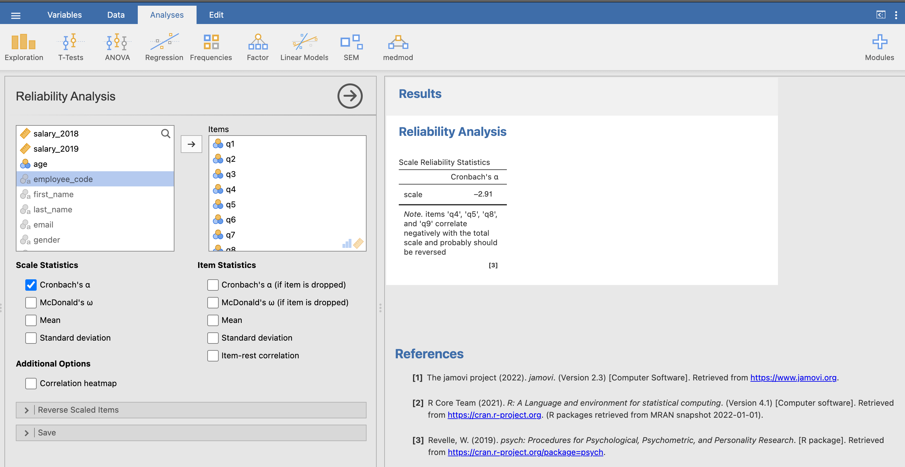
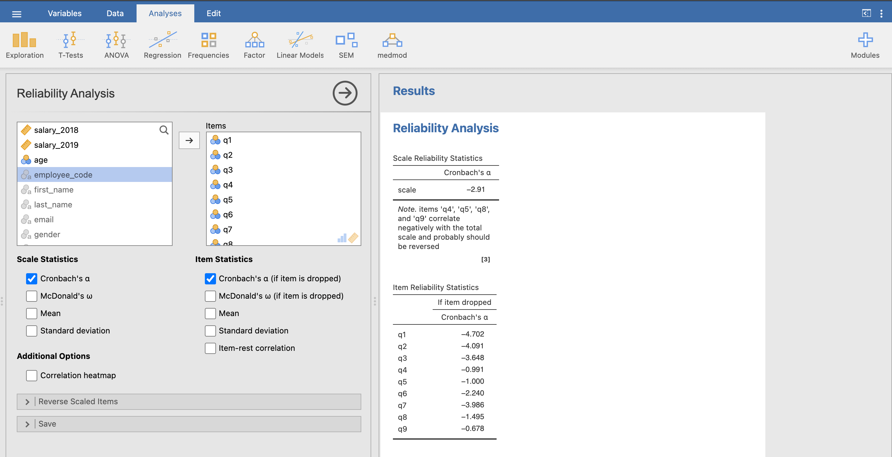
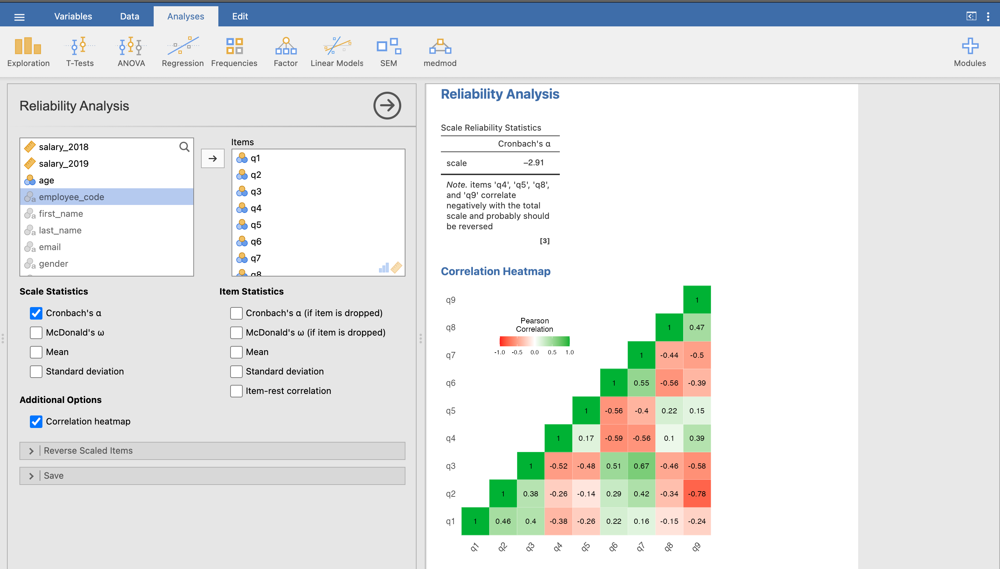
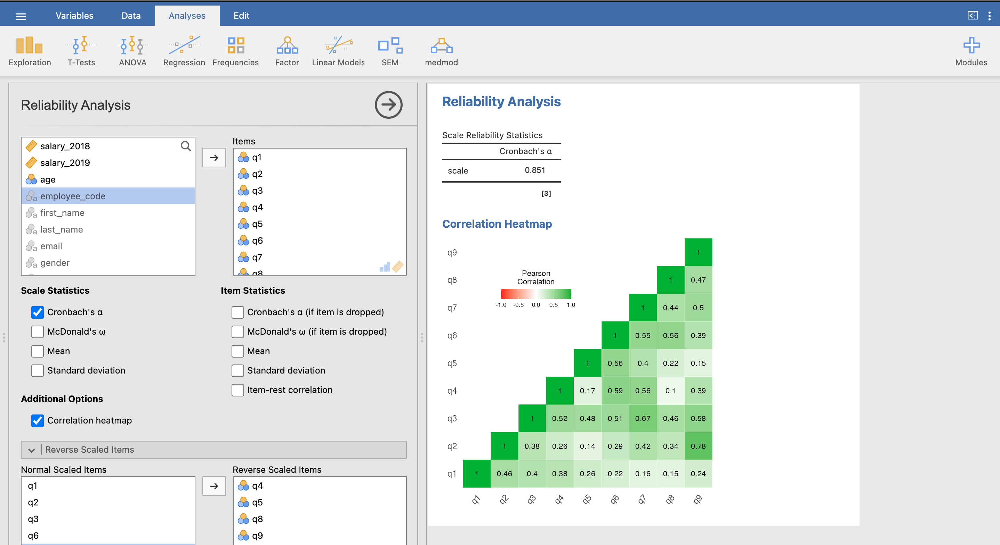
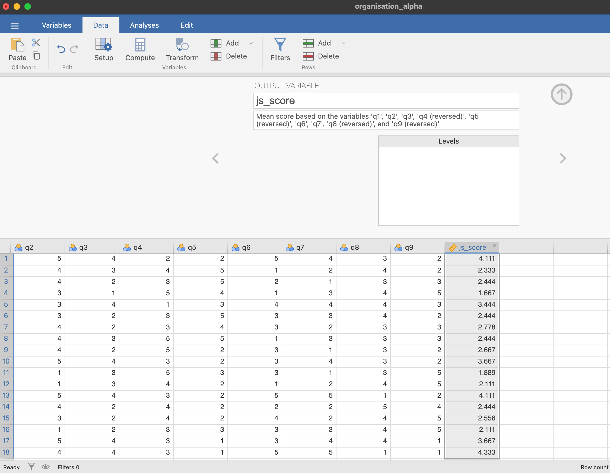
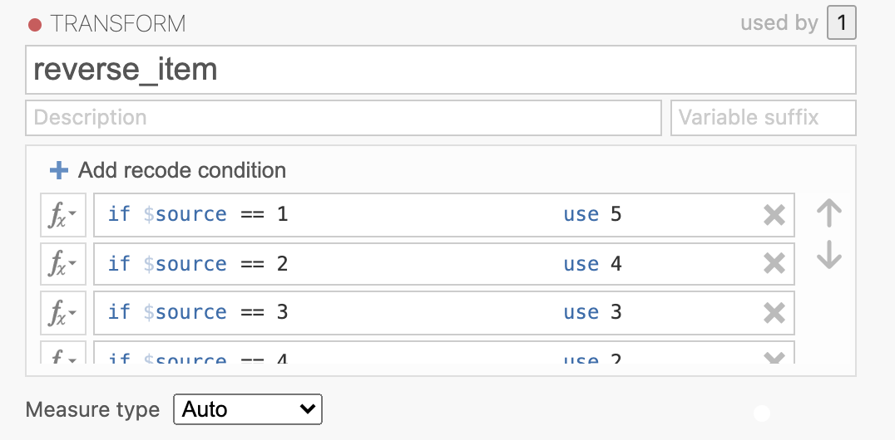
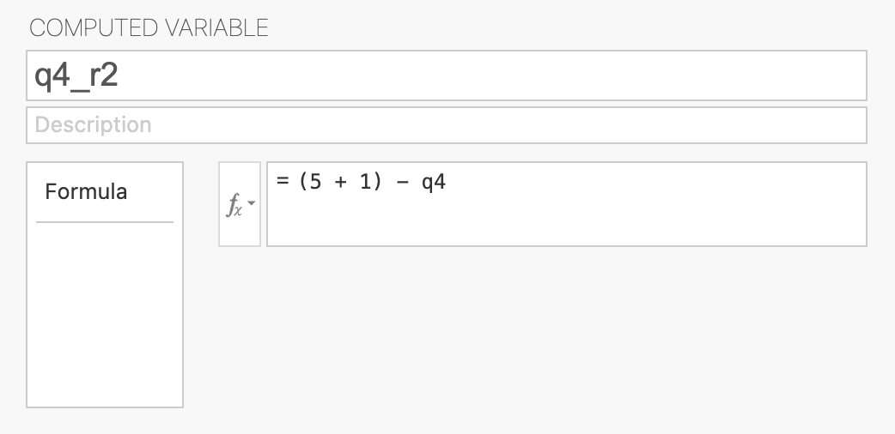
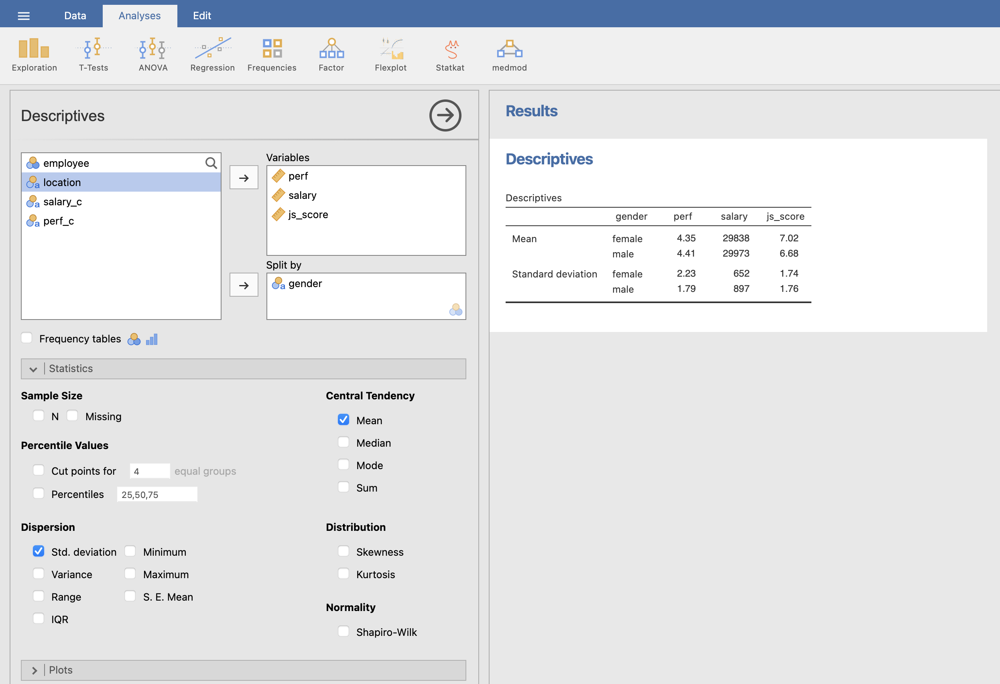
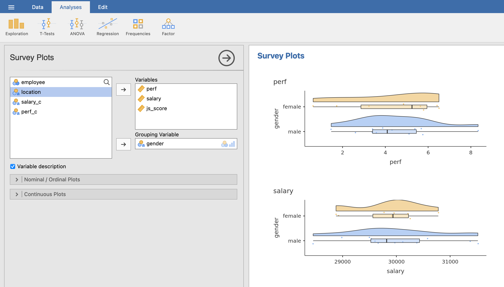
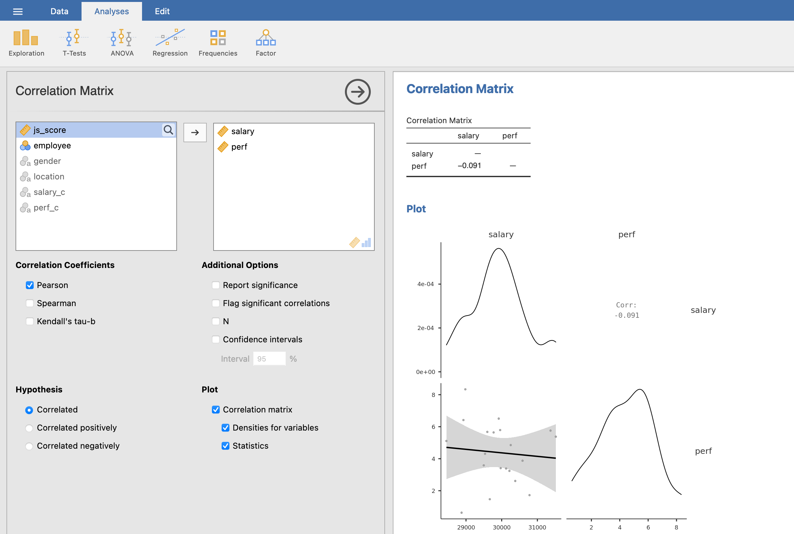

```{r setup, include = FALSE}
# libraries --------------------------------------------------------------------
library(anicon)
library(countdown)
library(DiagrammeR)
library(fontawesome)
library(kableExtra)
library(knitr)
library(tidyverse)

# general options --------------------------------------------------------------
options(scipen = 999)
set.seed(123)

# chunk options ----------------------------------------------------------------
opts_chunk$set(
  cache.extra = rand_seed, 
  message = FALSE, 
  warning = FALSE, 
  error = FALSE, 
  echo = FALSE,
  cache = FALSE,
  comment = "", 
  fig.align = "center", 
  fig.retina = 3
  )
```

class: inverse, mline, center, middle

# 1. Requirements for Statistical Analyses

---

# Requirements for Statistical Analyses

Before starting statistical analyses, you have to:

--

- **Identify your variables**, their type (Categorical vs. Continuous), their role (Predictor vs. Ouctome), and their status (Observed vs. Latent)

--

- Properly **formulate your hypotheses** (e.g., each hypothesis include one continuous outcome and one or more predictors as well as how the outcome changes when the predictor increases)

--

- Accurately **draw your model** (e.g., each variable in a box, each arrow between boxes is an hypothesis that you will test)

--

- **Specify the equation corresponding to your model**. Every single piece of results obtained in the statistical tables are referring to this equation.

---

class: inverse, mline, center, middle

# 2. From Data to Analyses

---

# Online Survey Platforms

Online Survey Software are replacing the paper-pencil method. Here is a list of some:

- Google Form (from your google drive, DCU hosted)
- Qualtrics (https://dcubusinessschool.eu.qualtrics.com, DCU Business School account)
- Survey Monkey (https://www.surveymonkey.com/, freemium)
- LimeSurvey (https://www.limesurvey.org/, freemium)
- Gorilla Experiment (https://gorilla.sc, pay per participants)

--
  
`r faa("exclamation-triangle", animate="flash", speed="slow", color="red")` Remember: 

- Always ask for age and gender in a survey
- Participant recruitment by list of contact/email has between 15% and 10% of answer rate

--

Platforms to find and reward participants:
- Amazon MTurk (https://www.mturk.com/ mainly US and India)
- Prolific Academic (https://www.prolific.co/ world wide)
- Qualtrics
- Survey Monkey

---

# Accessing your Data

From a **Google Form**
1. Login Google Account (be sure to use the DCU account)
2. Go to Drive
3. Click on your Survey form
4. Click on Response
5. Download Response Spreadsheet as .csv

From a **Qualtrics** survey
1. Login Qualtrics (DCU login/pwd) https://dcubusinessschool.eu.qualtrics.com
2. Click on Data & Analysis
3. Click on Export & Import > Export Data...> CSV (Use numeric values)

`r faa("exclamation-triangle", animate="flash", speed="slow", color="red")` Remember: 

- Always **save the unmodified version** of your data on the cloud (e.g., DCU google drive)
- Prefer downloading them as a **.csv file**

---

# JAMOVI: Stats. Open. Now.

Jamovi is a statistical spreadsheet software designed to be **easy to use**. Jamovi is a compelling alternative to costly statistical products such as SPSS, SAS and JMP to cite a few.

Jamovi will always be **free and open** because Jamovi is made by the scientific community, for the scientific community.

- It can be **downloaded from its website** https://www.jamovi.org/
- It can also be **used without installation**, in a web browser, https://cloud.jamovi.org/ for **online demo** but this demo undergoes periods of downtime, and may cease functioning (without warning) at any time.

`r faa("exclamation-triangle", animate="flash", speed="slow", color="red")` Book "Learning Statistics with JAMOVI" free here: https://www.learnstatswithjamovi.com/

```{r out.width='100%'}
include_graphics("https://www.jamovi.org/assets/header-logo.svg")
```

---
class: title-slide, middle

## Data Preparation

---

# Data Preparation

To test hypotheses involving latent variables measured from surveys, data for **each items have to be numeric** (e.g., from 1 to 7 or from 1 to 9).

Sometimes is automatically done by the survey platform, **if not you have to convert** participants' answers to numbers.

- In EXCEL, `Replace All` can be efficient but also dangerous.

> Example, replacing "Agree" with "4" will change all "Strongly Agree" to "Strongly 4".

- In JAMOVI, a transformation rule can be applied item by item (see next slide).

---

# Data Preparation

```{r}
include_graphics("img/jamovi_coding.gif")
```

---
class: title-slide, middle

## Scale Reliability

---

# Validity and Reliability

**Validity = is my variable measuring the construct that I think I am measuring?**
- Does the measurement make sense? 
- Would the results be reproduced with another scale measuring the same latent variable?
- Are the results correlated to latent variables that are related?

Validity test is only performed when a scale is created (no need for existing scales)

**Reliability = consistency of items inside a measurement**
- Test-retest reliability
- Inter-rater reliability
- Correlation inter-item (Cronbach's alpha)

Reliability test is performed every time a scale is used but only using Cronbach's alpha

---

# Validity and Reliability

```{r out.width='50%'}
include_graphics("https://www.publichealthnotes.com/wp-content/uploads/2018/08/560px-Reliability_and_validity.svg_.png")
```

---

# Latent Variable

In order to create a score for each theoretical constructs/concepts of your survey, **you need to make sure that your scale is reliable**.

Reliability assessment is performed every time a scale is used by **calculating its Cronbach's alpha**.

Cronbach's alpha indicates the **overall correlation between items** (inter-item correlation).

Cronbach's alpha has a maximum of 1:

- If its value is **higher than 0.7**, then the scale is reliable to measure the latent variable 
- If its value is **lower than 0.7**, then proceed with caution or remove/modify the scale to obtain a value higher than 0.7

**Latent variables are calculated only if the scale reliability (Cronbach's alpha) is satisfactory.**

---

# Cronbach's alpha in JAMOVI

In the `Analysis` Tab:
1. Click `Factor` icon
2. Select `Reliability Analysis`
3. Bring all the items for the same theoretical construct in the `Items` box

```{r out.width='80%'}

```

In our example, alpha = -2.91: **This too low and something is wrong**

---

# Cronbach's alpha in JAMOVI - Solution 1

Have a look at the Cronbach's alpha **if an item is dropped**:

```{r out.width='100%'}

```

---

# Cronbach's alpha in JAMOVI - Solution 2

.pull-left[
Some scales include **negative formulation** of some items to check that participants are reading the questions.

For example, in a Job Satisfaction scale:
- $q1$: I love my job
- $q2$: I like going to work everyday
- $q3$: I hate what I'm doing at work

If I answer high to the 2 first items, my answer to the 3rd item should be low. 

However, to calculate a Latent Variable score **all items should have the same formulation** (all positive formulation or all negative formulation). 

Here, **the answers of the 3rd item have to be reversed**. 

]

--

.pull-right[
For an item ranging from 0 to 10, reversing this item will apply the following transformation:
- 0 becomes 10
- 1 becomes 9
- ...
- 10 becomes 0

```{r out.width='80%'}
include_graphics("img/cronbach_5.png")
```
]

---

# Cronbach's alpha in JAMOVI - Solution 2

To identify which items have to be reversed, **have a look at the correlation heatmap**:
- If one item is negatively correlated with the others (values < 0 and red colour), this item has a different formulation
- Add the negatively correlated item to `Reverse Scaled Item` to observe the changes

Heatmap **before** reversing negatively correlated items:

```{r out.width='70%'}

```

---

# Cronbach's alpha in JAMOVI - Solution 2

To identify which items have to be reversed, **have a look at the correlation heatmap**:
- If one item is negatively correlated with the others (values < 0 and red colour), this item has a different formulation
- Add the negatively correlated item to `Reverse Scaled Item` to observe the changes

Heatmap **after** reversing negatively correlated items:

```{r out.width='70%'}

```

---
class: title-slide, middle

## Latent Variable Score

---

# Compute Latent Variable Score

When Cronbach's alpha is satisfying enough, then calculate the **latent variable score by averaging the items** kept and reversed (don't include original items if they have been reversed)

```{r out.width='50%'}
include_graphics("https://www.memecreator.org/static/images/memes/3335270.jpg")
```

---

# Compute Latent Variable Score

In our example, here are the results with 3 employees:
- The item $q3$, negatively formulated, has been reversed in $q3_r$
- The score of the "Job Satisfaction" latent variable is calculated using the average of $q1$, $q2$ and $q3_r$ items.

```{r}
tribble(
  ~employee, ~q1, ~q2, ~q3, ~q3_r,
   "Sinead",   7,   5,   2,     8,
  "Patrick",   5,   4,   6,     4,
   "Damien",   3,  1,    7,     3
) |> 
  rowwise() |> 
  mutate(job_satisfaction_score = mean(c(q1, q2, q3_r))) |> 
  kable(
    col.names = c("employee", "$q1$", "$q2$", "$q3$", "$q3_r$", "job_satisfaction_score"),
    escape = TRUE
  )
```

In JAMOVI, there are two ways to calculate the average value of items:

1. Automatically within `Reliability Analysis` 
2. Manually by reversing all the items that need to be reversed and by creating an average variable

---

# Automatic Calculation

To automatically calculate the average of all items (including reversed items) and creating the latent variable score:

- After obtaining a satisfying Cronbach's alpha, unfold the `Save` options on the left menu.
- Tick `Mean score` (a new column is created in your data)

```{r out.width='80%'}
include_graphics("img/cronbach_save.png")
```

---

# Automatic Calculation

Rename the newly created column from the `Data` tab:

```{r out.width='60%'}

```

`r faa("exclamation-triangle", animate="flash", speed="slow", color="red")` Warning: the calculation of the average includes the reversed items but the values of the reversed items themselves haven't been modified in the Data.

---

# Manual Calculation

First, manually reverse all items that need to be reversed by either:

.pull-left[
- Data > Transform: edit

```{r}

```
]

.pull-right[
- Data > Compute Variable
```
= (max scale + min scale) - variable
```

```{r}

```
]

Second, create a variable by calculating the average from the relevant items:

---
class: title-slide, middle

## Demonstration

---
class: title-slide, middle

## Exercise

1. Open the file "organisation_alpha.xls" in Jamovi
2. Perform a reliability test of the items q1 to q9
3. Calculate the latent variable `Job Satistfaction` for these items

```{r}
countdown(minutes = 10, warn_when = 60)
```

---
class: inverse, mline, center, middle

# 3. Descriptives Statistics

---

# Describing the Distribution of Variables

In an Academic Research Paper, once the latent variables are calculated, basic statistical summaries are calculated and presented in a text.

Here is a screenshot from a published paper:

```{r out.width='100%'}
include_graphics("img/paper_descriptive.png")
```

---

# Summary Tables in Jamovi

In the `Analyses` Tab, `Exploration` Icon, select Descriptives and choose your variables:

```{r out.width='80%'}

```

---

# Summary Figures in Jamovi

```{r out.width='100%'}
include_graphics("img/jamovi_descr_figure_1.png")
```

---

# Summary Figures in Jamovi

```{r out.width='100%'}

```

---

# Correlation Matrix with Predictors

In the `Analyses` Tab, `Regression` Icon, select Correlation Matrix and choose your variables:

```{r out.width='100%'}

```

---
class: inverse, mline, center, middle

# 4. Inferential Statistics

---

# Relationship between Variables

The relationship between a $Predictor$ or multiple $Predictors$ with an $Outcome$ variable is stated in a main effect hypothesis or in an interaction effect hypothesis.

The value of how much of the Outcome variable changes:
- Is called the **Estimate** (also called Unstandardised Estimate)
- Uses the letter $b$ in equations (e.g., $b_1$, $b_2$, $b_3$, ...)

We can distinguish two types of effect hypothesis:

- Main Effect Hypothesis:

> The relationship between 1 predictor and 1 outcome.

- Interaction Effect Hypothesis:

> The relationship between 2 or more predictors and 1 outcome. An interaction means that **the effect of a Predictor 1 on the Outcome variable will be different according the possibilities of a Predictor 2** (also called Moderation).

---

# Main Effect Relationship

.pull-left[
.center[Relationship between one Predictor and one Outcome variable]

```{r eval=TRUE, fig.align="left"}
grViz("
  digraph {
    graph [rankdir = LR]
    node [shape = box]
    
    Predictor -> Outcome
  }", height = 200, width = 400)
```

This model tests one hypothesis:
- 1 main effect

]
.pull-right[
.center[Relationship between two Predictors and one Outcome variable]

```{r eval=TRUE}
grViz("
  digraph {
    graph [rankdir = LR]
    node [shape = box]
    
    'Predictor 1' -> Outcome
    'Predictor 2' -> Outcome
  }", height = 200, width = 400)
```

This model tests two hypotheses:
- 2 main effects
]

---

# Interaction Effect Relationship

.pull-left[
classic representation:
```{r}
grViz("
  digraph {
    graph [rankdir = LR]
  
    node [shape = box]
    'Predictor 1'; 'Predictor 2'; Outcome
    node [shape = point, width = 0, height = 0]
    ''
    
    'Predictor 2' -> ''
    'Predictor 1' -> '' [arrowhead = none]
    ''-> Outcome
    
    subgraph {
      rank = same; 'Predictor 2'; '';
    }
  }", height = 200, width = 400)
```
]

.pull-right[
is the same as:
```{r}
grViz("
  digraph {
    graph [rankdir = LR]
    node [shape = box]

    
    'Predictor 1' -> Outcome
    'Predictor 2' -> Outcome
    'Predictor 1 X Predictor 2' -> Outcome
  }", height = 200, width = 400)
```
]

This model tests three hypotheses:
- 2 main effects
- 1 interaction effect

---

# The General Linear Model

A General Linear Model is used **to test all the hypotheses at once** and to calculate the predictors' estimate (relationship strength with the outcome).

Example:

$$Outcome = b_{0} + b_{1}\,Predictor\,1 + b_{2}\,Predictor\,2+ b_{3}\,Predictor\,1*Predictor\,2 + e$$

The estimates $b_0, b_1, ..., b_n$ are calculated by a JAMOVI.

- $b_0$ is the intercept and has no interest for hypothesis testing
- $b_1, ..., b_n$ are predictors' effect estimate and each of them is used to test an hypothesis

The predictors' effect estimate $b_1, ..., b_n$ are **the value of the slope of the best line between each predictor** and the outcome. 

It indicates **how many units of the outcome variable increases/decreases/changes when the predictor increases by 1 unit**

---

# Analysis of the Estimate

- If $b_1, ..., b_n = 0$, then:
  - The regression line is horizontal (no slope)
  - When the Predictor increases by 1 unit, the Outcome variable does not change
  - **The null hypothesis is not rejected**

--

- If $b_1, ..., b_n > 0$, then:
  - The regression line is positive (slope up)
  - When the Predictor increases by 1 unit, the Outcome variable increases by $b$
  - **The null hypothesis is rejected and the alternative hypothesis considered as plausible**

--

- If $b_1, ..., b_n < 0$, then:
  - The regression line is negative (slope down)
  - When the Predictor increases by 1 unit, the Outcome variable decreases by $b$
  - **The null hypothesis is rejected and the alternative hypothesis considered as plausible**
  
---

# Significance of Effect's Estimate

The statistical significance of an effect estimate depends on the **strength of the relationship** and on the **sample size**:

- An estimate of $b_1 = 0.02$ can be very small but still significantly different from $b_1 = 0$
- Whereas an estimate of $b_1 = 0.35$ can be stronger but in fact not significantly different from $b_1 = 0$

--

The significance is the probability to obtain your results with your sample in the null hypothesis scenario:

- Also called $p$-value
- Is between 0% and 100% which corresponds to a value between 0.0 and 1.0

**If the $p$-value is lower to 5% or 0.05, then the probability to obtain your results in the null hypothesis scenario is low enough to say that the null hypothesis scenario is rejected and there must be a link between the variables.**

--

Remember that the $p$-value is the probability of the data given the null hypothesis: $P(data|H_0)$.

---
class: title-slide, middle

## Hypotheses with Continuous Predictors and with Categorical Predictors Having 2 Categories

---

# Hypothesis Testing

1. Check the type of your variables
2. **Analyses** > **Regression** > **Linear Regression**
3. Set the Outcome as DV and 
  - **To test main effect hypotheses**: set the Predictors as Covariates/Factors
  - **To test interaction effect hypotheses**: In `Model Builder`, select all predictors with <kbd>CTRL</kbd> (win) or <kbd>command</kbd> (mac) and bring them as **interaction** in the model
  
--
  
Communicate the Results about the full model and each hypothesis:

- Use **Model Fit Measure Table** to evaluate the accuracy of the full model

> The predictions from a model including all effects are significantly/not-significantly better than without these effects $(R^2 = value_{R^2}$, $F(df1,df2) = value_{F}$, $p = value_{p})$

- Use **Model Coefficients Table** to conclude about each hypothesis

> The effect of $Predictor$ on $Outcome$ is statistically significant/not-significant, therefore $H_0$ can be rejected/accepted $(b = value_{estimate}, 95\% CI [lower\,CI, upper\,CI]$, $t(df2) = value_t$, $p = value_{p})$.

---
class: title-slide, middle

## Hypotheses with Categorical Predictors Having 3 or more Categories

---

# Hypothesis Testing

1. Check the type of your variables
2. **Analyses** > **Regression** > **Linear Regression**
3. Set the Outcome as DV and 
  - **To test main effect hypotheses**: set the Predictors as Factors
  - **To test interaction effect hypotheses**: In `Model Builder` options, select all predictors with <kbd>CTRL</kbd> (win) or <kbd>command</kbd> (mac) and bring them as **interaction**
5. Tick **ANOVA Test** in `Model Coefficient` options
  
--
  
Communicate the Results about the full model and each hypothesis:

- Use **Model Fit Measure Table** to evaluate the accuracy of the full model

> The predictions from a model including all effects are significantly/not-significantly better than without these effects $(R^2 = value_{R^2}$, $F(df1,df2) = value_{F}$, $p = value_{p})$

- Use **Omnibus ANOVA Test Table** to conclude about each hypothesis

> The effect of $Predictor$ on $Outcome$ is statistically significant/not-significant, therefore $H_0$ can be rejected/accepted $(F(df_{predictor}, df_{residual}) = value_F$, $p = value_{p})$.

---
class: title-slide, middle

## Demonstration

Test of the following hypotheses:

- $H_a1:$ The **job satisfaction** of employees increases when their **salary (2018)** increases
- $H_a2:$ The **job satisfaction** of **female** employees is lower than the **job satisfaction** of **male** employees
- $H_a3:$ The effect of **salary (2018)** on **job satisfaction** is higher for **male** than it is for **female** employees

---
class: title-slide, middle

## Demonstration

Model Representation:

```{r}
grViz("
  digraph {
    graph [rankdir = LR]
  
    node [shape = circle]
    'job\nsatisfaction'; salary; gender
    node [shape = point, width = 0, height = 0]
    ''
    
    gender -> '' [label= b2]
    salary -> '' [arrowhead = none] [label= b1]
    ''-> 'job\nsatisfaction' [label= b3]
    
    subgraph {
      rank = same; gender; '';
    }
  }", height = 200, width = 400)
```

Corresponding Equation:

$$job\,satisfaction = b_0 + b_1\,salary + b2\,gender + b_3\,salary*gender + e$$

---

# Solution

```{r}
include_graphics("img/jamovi_regression_example.gif")
```

---

# Solution

```{r out.width='60%'}
include_graphics("img/jamovi_regression_table.png")
```

The predictions from model including $salary$, $gender$ and their interaction on $job\,satisfaction$ are not-significantly better than without these effects $(R^2 = 0.227$, $F(3,14) = 1.368$, $p = 293)$.

---

# Solution

```{r out.width='60%'}
include_graphics("img/jamovi_regression_table.png")
```

The effect of $salary$ on $job\,satisfaction$ is not statistically significant, therefore $H_0$ cannot be rejected $(b = 0.000, 95\% CI [-0,000, 0.000]$, $t(14) = 0.659$, $p = 0.520)$.

The effect of $gender$ on $job\,satisfaction$ is not statistically significant, therefore $H_0$ cannot be rejected $(b = 2.138, 95\% CI [-0,241, 4.517]$, $t(14) = 1.927$, $p = 0.074)$.

The interaction effect between $salary$ and $gender$ on $job\,satisfaction$ is not statistically significant, therefore $H_0$ cannot be rejected $(b = -0.000, 95\% CI [-0,000, 0.000]$, $t(14) = -1.701$, $p = 0.111)$.

---
class: title-slide, middle

## Exercise

Test the following hypotheses:

- $H_a1:$ The **job satisfaction** of employees increases when their **salary (2019)** increases
- $H_a2:$ The **job satisfaction** of employees in at least one **location** is different from the **job satisfaction** of employees in the other **locations**
- $H_a3:$ The effect of **salary (2019)** on **job satisfaction** is different for at least one **location** compared to the other **locations**

```{r}
countdown(minutes = 5, warn_when = 60)
```

---
class: title-slide, middle

## Mediation Hypotheses

---

# Mediation Effect

Models with more than one outcome variables are a closer step toward causal models while not testing causality directly.

For example, a model which demonstrate that an existing relationship may be explained by a third variable, is more explanatory than a classic linear model.

This model is called Mediation

> Mediation is a hypothesized pseudo-causal model, whereby effect of a predictor to an outcome is transmitted through an intermediary variable M

It is a useful tool for understanding the underlying mechanisms of how variables are related to each other.

```{r}
grViz("
  digraph {
    graph [rankdir = LR]
    
    Predictor -> {Mediator Outcome}
    Mediator -> Outcome

  }", width = 800, height = 200)
```

---

# Mediation Effect

Let's take the example from [University of Virginia](https://data.library.virginia.edu/introduction-to-mediation-analysis/): $self-esteem$ mediates the effect of $grades$ on $happiness$

Data analysis is also presented in the [Jamovi Advanced Mediation Model website](https://jamovi-amm.github.io/glm_example1.html) and the data can be downloaded [here](https://jamovi-amm.github.io/glm_example1.html)

```{r}
DiagrammeR::grViz("
  digraph {
    graph [rankdir = LR]
  
    node []
    'self-esteem'; 'grades'; happiness
    
    'grades' -> {happiness 'self-esteem'}
    'self-esteem' -> happiness

  }", width = 800, height = 300)
```

---

# Mediation Effect

Imagine that previous studies have suggested that higher grades predict higher happiness. This is the **Total Effect**.

```{r out.width="50%"}
include_graphics("https://data.library.virginia.edu/files/mediation_ex1.png")
```

However, grades are not the real reason that happiness increases. Let's hypothesize that good grades boost one’s self-esteem and then high self-esteem boosts one’s happiness. This is the **Indirect Effect**.

```{r out.width="50%"}
include_graphics("https://data.library.virginia.edu/files/mediation_ex2.png")
```

Self-esteem is a mediator that explains the underlying mechanism of the relationship between grades and happiness.

---

# Mediation Path Diagram

.pull-left[

```{r}
grViz("
  digraph {
    graph [rankdir = LR]
  
    Predictor -> Outcome [label=c]

  }", width = 400, height = 200)
```

]
.pull-right[

$c$ is the **total effect** of the Predictor on the Outcome

$$c = c' + a \times b$$
]

.pull-left[
```{r}
grViz("
  digraph {
    graph [rankdir = LR]
    
    Predictor -> Mediator [label=a]
    Mediator -> Outcome [label=b]
    Predictor -> Outcome [label=cʹ]
  
  }", width = 400, height = 200)
```
]

.pull-right[
$a$ - the estimate of the effect of the Predictor on the Mediator 

$b$ - the estimate of the effect of the Mediator on the Outcome

$c'$ - the **direct effect** of the Predictor on the Outcome

The path $ab$ is the **indirect effect** of the Predictor on the Outcome
]

---

# Is there Mediation?

A mediation is obtained if:
- The estimate $c$, **total effect**, is significantly different from 0 (**requirement 1**)
- The estimate $a$, between the predictor and the mediator, is significantly different from 0 (**requirement 2**)
- The estimate $c'$ has been reduced compared to the estimate $c$
- The **indirect effect** $ab$ is significantly different from 0

```{r out.width='40%'}
include_graphics("https://i.pinimg.com/736x/6e/f6/e2/6ef6e2c045756dacdde788c9de417690--mark-wahlberg-humor.jpg")
```

---

# Mediation Analysis in Jamovi

In Jamovi, install the **jAMM module** by clicking on the cross "Modules" at top right corner > Jamovi library.

Then follow the example described here: https://jamovi-amm.github.io/glm_example1.html

```{r out.width='70%'}
include_graphics("https://jamovi-amm.github.io/glm/main.png")
```

---

# Mediation with jAMM in JAMOVI

```{r}
include_graphics("img/mediation_jamovi_jamm.gif")
```

---

# Mediation with jAMM in JAMOVI

In this example, the following mediation hypothesis is tested:

> The effect of **grades** on students' **happiness** is explained by their **self-esteem**

```{r out.width='80%'}
include_graphics("https://jamovi-amm.github.io/examples/virginia_simple/results1.png")
```

--

- The estimate $c$, **total effect**, is significantly different from 0 $(c = 0.3961, 95\% CI [0.180, 0.612], z = 3.6, p < .001)$
- The estimate $a$, between the predictor and the mediator, is significantly different from 0 $(a = 0.5610, 95\% CI [0.378, 0.744], z = 5.998, p < .001)$
- The estimate $c'$ has been reduced compared to the estimate $c$ $(c = 0.3961\,vs.\,c' = 0.0396)$
- The **indirect effect** $ab$ is significantly different from 0 $(ab = 0.3565, 95\% CI [0.197, 0.516], z = 4.382, p < .001)$

---
class: title-slide, middle

## Exercise

Test the following hypothesis:

> The effect of **Salary** on **Job Satisfaction** is explained by employee's **Age**

A mediation is obtained if:
- The $p$-value of the estimate $c$, **total effect**, is significant
- The $p$-value of the estimate $a$, **between the predictor and the mediator**, is significant
- The estimate $c'$, **direct effect**, has been reduced compared to the estimate $c$, **total effect**.
- The $p$-value of the **indirect effect** $ab$ is significant

```{r out.width='80%'}
countdown(minutes = 5, warn_when = 60)
```

---
class: title-slide, middle

## Last Advice

---

# Good Practices with Hypothesis Testing

- All hypotheses using the **same Outcome variable have to be tested in the same model** and not separately.

- Even if available, no need to use t-tests or ANOVA separate modules because the **Linear Regression can test all types of hypothesis**.

- **Do not use a correlation matrix to test your hypotheses**, they are excursively dedicated to evaluate correlations between predictors.

- A $p$-value never equals $0$, **round to $p < .001$ if shown as $0.000$**.

--

To know more about Variables, Hypothesis Formulation, Models, Equations, and Hypothesis Testing with the General Linear Model, see my slides [MT611: Quantitative Research Methods](https://damien-dupre.github.io/) from Lecture 1 to Lecture 6

To know more about Mediation Hypothesis Testing, see my slides [MT612: Advanced Quantitative Research Methods](https://damien-dupre.github.io/mt612/lectures/lecture_5) Lecture 5

---
class: inverse, mline, left, middle


# Thanks for your attention and don't hesitate if you have any questions!

[`r fa(name = "twitter")` @damien_dupre](http://twitter.com/damien_dupre)  
[`r fa(name = "github")` @damien-dupre](http://github.com/damien-dupre)  
[`r fa(name = "link")` damien-datasci-blog.netlify.app](https://damien-datasci-blog.netlify.app)  
[`r fa(name = "paper-plane")` damien.dupre@dcu.ie](mailto:damien.dupre@dcu.ie)