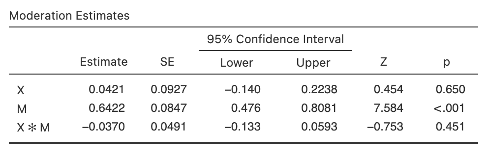
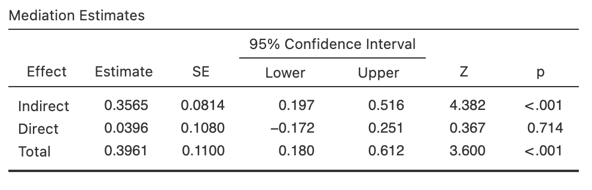

```{r setup, include = FALSE}
# libraries --------------------------------------------------------------------
library(anicon)
library(DiagrammeR)
library(emo)
library(fontawesome)
library(knitr)
library(nomnoml)
library(plotly)
library(tidyverse)

# general options --------------------------------------------------------------
options(scipen = 999)
set.seed(123)
# chunk options ----------------------------------------------------------------
opts_chunk$set(
  cache.extra = rand_seed, 
  message = FALSE, 
  warning = FALSE, 
  error = FALSE, 
  echo = FALSE,
  cache = TRUE,
  comment = "", 
  fig.align = "center", 
  fig.retina = 3
  )

# functions --------------------------------------------------------------------
rtruncnorm <- function(N, mean = 0, sd = 1, a = -Inf, b = Inf) {
  U <- runif(N, pnorm(a, mean, sd), pnorm(b, mean, sd))
  qnorm(U, mean, sd) 
}

# data -------------------------------------------------------------------------
df_data <- 
  tibble(
    predictor = rtruncnorm(100, mean = 5, sd = 2.5, a = 0, b = 10),
    outcome = 2 + 0.9 * predictor + rnorm(100, mean = 0, sd = 1)
  )

df_lm <- lm(outcome ~ predictor, df_data)

df_data <- df_data %>% 
  mutate(
    b0 = rnorm(100, df_lm$coefficients[["(Intercept)"]], 4),
    b1 = rnorm(100, df_lm$coefficients[["predictor"]], 1)
  )
```

# Structure of a Statistical Analysis

In academic research paper all sections are linked:

.center[**Introduction `r ji("right_arrow")` Literature Review `r ji("right_arrow")` Method `r ji("right_arrow")` Results `r ji("right_arrow")` Discussion & Conclusion**]

--

To understand the statistics in the results section it is essential to identify the concepts presented in each section:

```{nomnoml, fig.width=12, fig.height=2}
#stroke: black
#direction: right
#align: center
[Introduction | Variables]->[Literature Review | Hypotheses]
[Literature Review | Hypotheses]->[Method | Model & Equation]
[Method | Model & Equation]->[Results | Statistical Test]
[Results | Statistical Test]->[Discussion & Conclusion | Interpretation]
```

--

### Definitions:

- A __Moderation Model__ tests at least 3 hypotheses (2 main effect hypotheses and 1 interaction effect hypothesis) within 1 equation
- A __Mediation Model__ tests 1 hypothesis (but requires 2 other hypotheses to be satisfied) within 3 equations

---
class: inverse, mline, center, middle

# 1. Essential Concepts to Master

---

# Variables

__Type of Variables__

.pull-left[
- **Continuous**: If values are numbers
- **Categorical**: If values are characters

`r faa("arrow-circle-right", animate="horizontal", speed="slow", color="blue")` Note: Distinguish **Categorical Nominal** variables (*e.g.*, Irish, French) vs. **Categorical Ordinal** variables (*e.g.*, XS, S, M, L, XL)

]

.pull-right[
```{r out.width='50%'}
include_graphics("img/jamovi_icons.png")
```
]

--

__Role of Variables__

- **Outcome**: "to be explained" variable as Y (also called Dependent Variable or DV)
- **Predictor**: "doing the explaining" as X (also called Independent Variable or IV)

`r faa("arrow-circle-right", animate="horizontal", speed="slow", color="blue")` Note: 
- A "Moderator" is another name for **Predictor**
- A "Mediator" is a variable both used as **Predictor** and as **Outcome**

---

# Hypotheses

Hypotheses are:

- Predictions supported by theory/literature
- Affirmations designed to precisely describe the relationships between variables

A hypothesis test consists of a **test between two competing hypotheses**:

- An alternative hypothesis $H_a$ (also called $H_1$)
- A null hypothesis $H_0$ (pronounced "H-naught" or "H-zero")

> For $H_0$, there is no relationship between the variables. $H_a$ is the "challenger" hypothesis, it claims the existence of a relationship.

--

`r faa("star", animate="burst", speed="slow", color="orange")` Challenge: An hypothesis require an **appropriate formulation** of the expected changes for the outcome when the predictor increases (e.g., don't use "is related to", "influences", "correlates" which are not clear enough)

If predictor is continuous: .center["The {**outcome**} increases/decreases when the {**predictor**} increases"]

---

# Model Representation

A graphic representation of the model's hypothesised effects can be done but 4 rules must be applied:

- Variable names are the same as the ones in the data and the ones used in hypotheses
- Square boxes are used for actual measure and round boxes are used for latent variables (but this is not respected)
- All the arrows correspond to an hypothesis to be tested
- All the tested hypotheses have to be represented with an arrow

```{r eval=TRUE}
grViz("
digraph {
  graph [rankdir = LR]
  
  node [shape = oval]
  Predictor; Outcome
        
  Predictor -> Outcome [label= b1]
}
", width = 800, height = 200)
```

---

# Model Equation

The basic structure of a statistical model is:

$$Outcome = Model + Error$$

where the $Model$ is a series of predictors that are expressed in hypotheses related to the same outcome.

*Example:*

$$Outcome = Pred1 + Pred2 + Pred1 * Pred2 + Error$$

--

To evaluate their relationship with the outcome, each effect hypothesis is related with a coefficient called **Estimate** and represented with the letter $b$ as follow:

$$Outcome = b_0 + b_1\,Pred1 + b_2\,Pred2 + b_3\,Pred1 * Pred2 + Error$$

`r faa("arrow-circle-right", animate="horizontal", speed="slow", color="blue")` Note: $b_0$ is the estimate related to the intercept. It is always included, always tested but has no interest in the analysis

---
class: inverse

# The Estimate $b$

.pull-left[
To find the **Estimate** for the intercept and each predictor, all possible lines are calculated and the one with the lowest amount of error is selected
]

.pull-right[
```{r fig.width=5, fig.height=3}
ggplot(df_data, aes(predictor, outcome)) + 
  geom_abline(aes(intercept = b0, slope = b1), alpha = 1/4) +
  geom_point(na.rm = TRUE) +
  scale_x_continuous(breaks = c(0, seq(0:10)), limits = c(0, 10)) +
  scale_y_continuous(limits = c(0, 10)) +
  theme(
    # axis.text.x = element_blank(), 
    # axis.text.y = element_blank(),
    text = element_text(size = 20)
  )
```
]

.pull-left[
The **Estimate of the Intercept** corresponds to the value of the Outcome when the Predictor is $0$.

The **Estimate of each Predictor** corresponds to how many units the Outcome increases when the Predictor increase by $1$ unit (slope of the line).

]

.pull-right[
```{r fig.width=5, fig.height=3}
ggplot(df_data, aes(predictor, outcome)) +
  geom_point(color = "gray", size = 2, alpha = 0.5, na.rm = TRUE) +
  geom_smooth(method = "lm", fullrange = TRUE, se = FALSE, na.rm = TRUE) +
  geom_hline(yintercept = df_lm$coefficients[["(Intercept)"]], color = 'black', size = 0.5, linetype = 'dotted') +
  annotate("text", x = 8, y = df_lm$coefficients[["(Intercept)"]] + 0.5, label = "Intercept Estimate b0") +
  annotate('segment', x = 1, xend = 2, y = df_lm$coefficients[["(Intercept)"]] + 1*df_lm$coefficients[["predictor"]], yend = df_lm$coefficients[["(Intercept)"]] + 1*df_lm$coefficients[["predictor"]], color = 'red') +
  annotate('segment', x = 2, xend = 2, y = df_lm$coefficients[["(Intercept)"]] + 1*df_lm$coefficients[["predictor"]], yend = df_lm$coefficients[["(Intercept)"]] + 2*df_lm$coefficients[["predictor"]], color = 'red') +
  annotate("text", x = 4, y = df_lm$coefficients[["(Intercept)"]] + 1.5*df_lm$coefficients[["predictor"]], label = "Predictor Estimate b1") +
  scale_x_continuous(breaks = c(0, seq(0:10)), limits = c(0, 10)) +
  scale_y_continuous(limits = c(0, 10)) +
  theme_bw() +
  theme(
    text = element_text(size = 20)
  )
```

]

---

# Evaluation of the Significance

Testing for the significance of the effect means evaluating **if this estimate $b$ value is significantly different than 0** as stated in the alternative hypothesis $(H_a:b \neq 0)$ 

`r faa("arrow-circle-right", animate="horizontal", speed="slow", color="blue")` Note: $H_0$ will always predict that $b = 0$

--

The statistical significance of an effect estimate depends on the **strength of the relationship** and on the **sample size**:

- An estimate of $b_1 = 0.02$ can be very small but still significantly different from $b_1 = 0$
- A higher estimate of $b_1 = 5.35$ can be not significantly different from $b_1 = 0$

--

The significance, called $p$-value, is the probability to consider $H_0$ as True. This probability is between 0% and 100% which corresponds to a value between 0.0 and 1.0.

If the $p$-value:

- Is **higher** than 5% or 0.05, then $H_0$ is **accepted**
- Is **lower** than 5% or 0.05, then $H_0$ is **rejected** and $H_a$ is considered as plausible

---

# Good Practices with Hypothesis Testing

- All hypotheses using the **same Outcome variable have to be tested in the same model** and not separately.

- **Do not use a correlation matrix to test your hypotheses**, they are excursively dedicated to evaluate correlations between predictors.

- A $p$-value never equals $0$, **round to $p < .001$ if lower than $0.001$**.

- Despite never shown in academic papers, the **4 conditions of applications for Linear Model should always be checked**:
  - Linearity of the relationship,
  - Normal distribution of the residuals,
  - Homogeneity of the residuals,
  - Independence of observations.
  
---

# JAMOVI: Stats. Open. Now.

Jamovi is a statistical spreadsheet software designed to be **easy to use**. Jamovi is a compelling alternative to costly statistical products such as SPSS, SAS and JMP to cite a few.

Jamovi will always be **free and open** because Jamovi is made by the scientific community, for the scientific community.

It can be **downloaded from its website** https://www.jamovi.org/

```{r out.width='100%'}
include_graphics("https://www.jamovi.org/assets/header-logo.svg")
```

`r faa("exclamation-triangle", animate="flash", speed="slow", color="red")` Book "Learning Statistics with JAMOVI" free here: https://www.learnstatswithjamovi.com/

---

# *medmod* Module from Jamovi Library

By default Jamovi is installed with basic modules (e.g., descriptive statistics, T-Test, ANOVA, Linear Regression, Reliability Analysis with Cronback alpha) 

.pull-left[
To install a new module:

- Click on the plus sign "Modules" at the top right corner.
- Select "jamovi library" and Install "medmod"
]

.pull-right[
```{r out.width='50%'}
include_graphics("https://i0.wp.com/www.rensvandeschoot.com/wp-content/uploads/html_import/35260d0d86cd4e37b8ae8d5b7a7bce5a.jpg?ssl=1")
```
]

The __medmod__ module will allow you to easily test Moderation and Mediation models

```{r out.width='40%'}
include_graphics("https://i0.wp.com/www.rensvandeschoot.com/wp-content/uploads/html_import/f172104e6a0f45c4be2f299d95558f6a.jpg?w=600&ssl=1")
```

---
class: inverse, mline, center, middle

# 2. Moderation Model

---

# Hypotheses - Representation - Equation

A moderation model is a linear regression model testing at least __2 main effect hypotheses and 1 interaction effect hypothesis__ in the most simple case

--

Hypothesis templates:

- Main effect hypothesis 1: .center["The {**outcome**} increases/decreases when the {**predictor**} increases"]
- Main effect hypothesis 2: .center["The {**outcome**} increases/decreases when the {**moderator**} increases"]
- Interaction effect hypothesis: .center["The effect of the {**predictor**} on the {**outcome**} increases/decreases when the {**moderator**} increases"]

--

`r faa("arrow-circle-right", animate="horizontal", speed="slow", color="blue")` Notes:
1. __Predictor__ and __moderator__ are commutable (can be inverted and produce the same hypothesis)
2. By default, an moderation model __involves the test of the main effect hypotheses__ of all Predictors/Moderators

---

# Hypotheses - Representation - Equation

The moderation model representation involves a crossing arrow:

```{r}
grViz("
  digraph {
    graph [rankdir = LR]
  
    node [shape = circle]
    Predictor; Outcome; Moderator
    node [shape = point, width = 0, height = 0]
    ''
    
    Moderator -> '' [label = b2]
    Predictor -> '' [arrowhead = none] [label = b1]
    ''-> Outcome [label = b3]
    
    subgraph {
      rank = same; Moderator; '';
    }
  }", width = 800, height = 200)
```

`r faa("exclamation-triangle", animate="flash", speed="slow", color="red")` Warning: This crossing arrow does not involve the test of 1 or 2 hypotheses but the test of 3 hypotheses: $b1$ the main effect of the predictor, $b2$ the main effect of the moderator, and $b3$ the interaction effect between the predictor and the moderator

--

Indeed, this moderation model is tested by the following equation: 

$$Outcome = b_0 + b_1\,Predictor + b_2\,Moderator + b_3\,Predictor * Moderator + Error$$

The symbol `*` indicates the interaction between the Predictor and the Moderator variables (i.e., what most people call a moderation effect)

---

# Testing a Moderation Model in Jamovi

.pull-left[
1. **Analyses** > **medmod** > **Moderation**
2. Set your variables
3. Display for your Estimates: 
  - Test statistics (selected by default)
  - Confidence interval (to select)
]

.pull-right[
```{r out.width='100%'}

```
.center[Example of the Moderation output table]
]

--

Then communicate your results on each hypothesis with an academic style:

> The main effect of $Predictor$ on $Outcome$ is statistically significant, therefore $H_0$ can be rejected and $H_a$ considered as plausible $(b = value_{estimate}$, $95\% CI [lower,upper]$, $Z = value_Z$, $p = value_{p})$.

> The main effect of $Moderator$ on $Outcome$ is statistically significant, therefore $H_0$ can be rejected and $H_a$ considered as plausible $(b = value_{estimate}$, $95\% CI [lower,upper]$, $Z = value_Z$, $p = value_{p})$.

> The interaction effect between $Predictor$ and $Moderator$ on $Outcome$ is statistically significant, therefore $H_0$ can be rejected and $H_a$ considered as plausible $(b = value_{estimate}$, $95\% CI [lower,upper]$, $Z = value_Z$, $p = value_{p})$.

---

# Example

```{r out.width='70%'}

```

--

> The main effect of $X$ on $Y$ is not statistically significant, therefore $H_0$ can be accepted $(b = 0.0421$, $95\% CI [-0.140,0.2238]$, $Z = 0.454$, $p = 0.650)$.

--

> The main effect of $M$ on $Y$ is statistically significant, therefore $H_0$ can be rejected and $H_a$ considered as plausible accepted $(b = 0.6422$, $95\% CI [0.476,0.8081]$, $Z = 7.584$, $p < .001)$.

--

> The interaction effect between $X$ and $M$ on $Y$ is not statistically significant, therefore $H_0$ can be accepted $(b = -0.0370$, $95\% CI [-0.133, 0.0593]$, $Z = -0.753$, $p = 0.451)$.

---
class: inverse, mline, center, middle

# 3. Mediation Model

---

# Hypotheses - Representation - Equation

The mediation model is a path analysis which involves __3 different linear models but only one of them is the test of the mediation__:

- Requirement effect hypothesis 1: .center[The {**outcome**} changes when the {**predictor**} increases]

- Requirement effect hypothesis 2: .center[The {**mediator**} changes when the {**predictor**} increases]

- Mediation effect hypothesis: .center[The effect of the {**predictor**} on the {**outcome**} is explained by the {**mediator**}]

--

`r faa("arrow-circle-right", animate="horizontal", speed="slow", color="blue")` Note: More complex Mediation models are possible involving interaction with control variables and multiple mediators (see for example https://jamovi-amm.github.io/glm_example2.html) but they must be tested with another Jamovi module called JAMM for Jamovi Advanced Mediation Models

---

# Hypotheses - Representation - Equation

The mediation model representation involves at least three arrows:

```{r}
grViz("
  digraph {
    graph [rankdir = LR]
  
    node []
    Predictor; Mediator; Outcome
    
    Predictor -> Outcome [label = b1_b3]
    Predictor -> Mediator [label = b2]
    Mediator -> Outcome [label = b4]

  }", width = 800, height = 200)
```

--

This moderation model is tested by the following equations: 

$$Outcome = b_{0} + b_{1}\,Predictor + Error$$
$$Mediator = b_{0} + b_{2}\,Predictor + Error$$
$$Outcome = b_{0} + b_{3}\,Predictor + b_{4}\,Mediator + Error$$

$b_{1}$ is called __Total effect__, $b_{3}$ is called __Direct effect__, and $b_{2}*b_{4}$ is called __Indirect effect__

A Mediation effect happens when $b_{1}$ (Total effect) is significant but $b_{3}$ (Direct effect) not significant

---

# Testing a Mediation Model in Jamovi

.pull-left[
1. **Analyses** > **medmod** > **Mediation**
2. Set your variables
3. Display for your Estimates: 
  - Test statistics (selected by default)
  - Confidence interval (to select)
]

.pull-right[
```{r out.width='100%'}

```
.center[Example of the Mediation output table]
]

--

Then communicate your results on the mediation hypothesis with an academic style:

> The total effect of $Predictor$ on $Outcome$ is statistically significant $(b = value_{estimate}$, $95\% CI [lower,upper]$, $Z = value_Z$, $p = value_{p})$. 

> However, taking into account $Mediator$ to explain this total effect results in a non significant direct effect of $Predictor$ on $Outcome$ $(b = value_{estimate}$, $95\% CI [lower,upper]$, $Z = value_Z$, $p = value_{p})$ while the indirect effect is statistically significant $(b = value_{estimate}$, $95\% CI [lower,upper]$, $Z = value_Z$, $p = value_{p})$.

> Therefore, $H_0$ can be rejected and the mediation effect hypothesis $H_a$ considered as plausible.

---

# Example

```{r out.width='70%'}

```

--

> The total effect of $X$ on $Y$ is statistically significant $(b = 0.3961$, $95\% CI [0.180,0.612]$, $Z = 3.600$, $p <.001)$. 

--

> However, taking into account $M$ to explain this total effect results in a non significant direct effect of $X$ on $Y$ $(b = 0.0396$, $95\% CI [-0.172,0.251]$, $Z = 0.367$, $p = 0.714)$ while the indirect effect is statistically significant $(b = 0.3565$, $95\% CI [0.197,0.0516]$, $Z = 4.382$, $p <.001)$.

--

> Therefore, $H_0$ can be rejected and the mediation effect hypothesis $H_a$ considered as plausible.

---
class: inverse, mline, center, middle

# 4. Discussion & Conclusion

---

# Interpret the Analyses

From here...

- There is no number to be shown and no specific guidelines
- Correct interpretation comes if results have been understood and if reasons for the results to be the ones obtained have been identified

```{r out.width='40%'}
include_graphics("https://pbs.twimg.com/media/EhjV0v-XgAEh2pk?format=jpg&name=large")
```

---
class: inverse, mline, left, middle


# Thank you for your attention!
## Don't hesitate to ask if you have any questions

[`r fa(name = "twitter")` @damien_dupre](http://twitter.com/damien_dupre)  
[`r fa(name = "github")` @damien-dupre](http://github.com/damien-dupre)  
[`r fa(name = "link")` damien-datasci-blog.netlify.app](https://damien-datasci-blog.netlify.app)  
[`r fa(name = "paper-plane")` damien.dupre@dcu.ie](mailto:damien.dupre@dcu.ie)